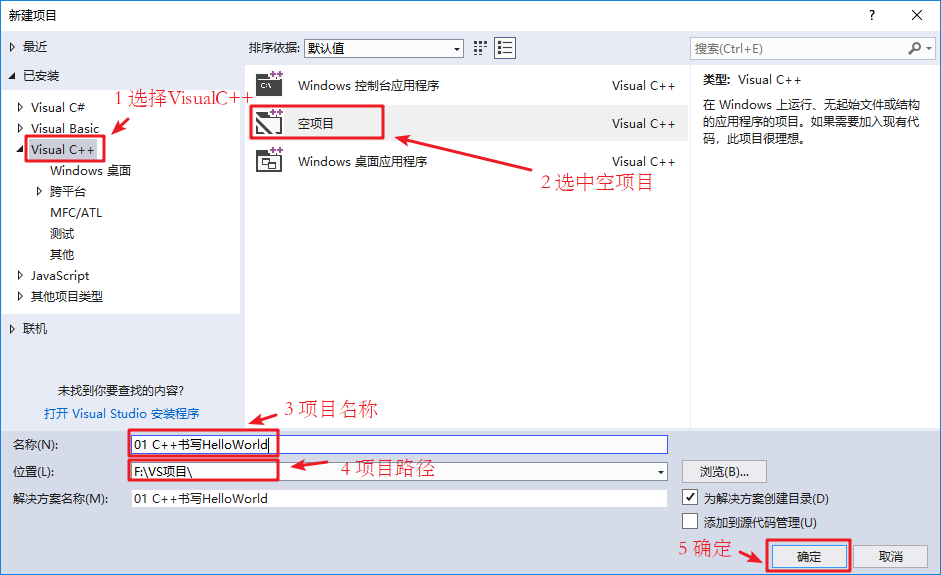
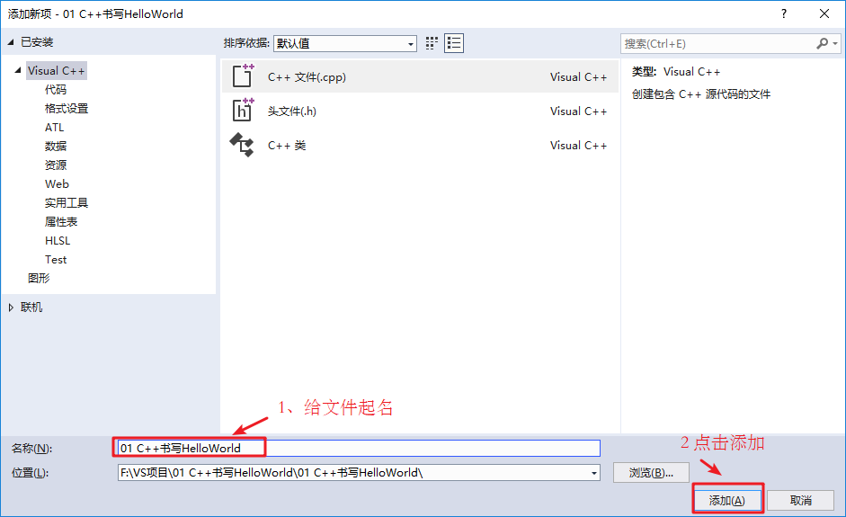

# C++ 初识

---

## 第一个 C++ 程序

编写一个 C++ 程序总共 4 个步骤

* 创建项目
* 创建文件
* 编写代码
* 运行程序

### 创建项目

先打开 Visual Studio




### 创建文件

右键源文件，选择添加->新建项




### 编写代码

demo:

```cpp
#include <iostream>

using namespace std;

int main()
{
    cout << "Hello world" << endl;
    return 0;
}
```

### 运行程序


---

## 注释

**作用**：在代码中增加说明和解释，方便自己或其他人阅读代码

**两种格式**

* **单行注释**：`// 描述信息` 
    * 通常放在一行代码的上方，或者一条语句的末尾，对该行代码说明
* **多行注释**： `/* 描述信息 */`
    * 通常放在一段代码的上方，对该段代码做整体说明

demo:

```cpp
#include <iostream>

using namespace std;

// 单行注释

/*
    多行注释
*/

int main()
{
    /*
        main 函数体
    */

    // 输出 Hello world
    cout << "Hello world" << endl;
    return 0;
}
```

> 提示：编译器在编译代码时，会忽略注释的内容

---

## 变量

**作用**：给一段指定的内存空间起名，方便操作这段内存

**语法**：

```cpp
数据类型 变量名 = 初始值;
```

demo:

```cpp
#include <iostream>

using namespace std;

int main()
{
    // 变量的定义
    // 语法：数据类型  变量名 = 初始值

    int a = 10;
    cout << "a = " << a << endl;

    /*
        a = 10
    */

    return 0;
}
```

> 注意：C++ 在创建变量时，尽可能给变量一个初始值。若不然，很多时候不仅仅会报错，还会因为未初始化而产生意外的结果

---

## 常量

**作用**：用于记录程序中不可更改的数据

C++ 定义常量两种方式

* **\#define** 宏常量：`#define 常量名 常量值`
    * 通常在文件上方定义，表示一个常量
* **const** 修饰的变量：`const 数据类型 常量名 = 常量值`
    * 通常在变量定义前加关键字 `const`，修饰该变量为常量，不可修改

demo:

```cpp
#include <iostream>

using namespace std;

// #define 宏常量
#define day 7

int main()
{
    cout << "一周里总共有 " << day << " 天" << endl;
    // day = 8;  // 报错，扩展到: 7，表达式必须是可修改的左值

    // const 修饰变量
    const int month = 12;
    cout << "一年里总共有 " << month << " 个月份" << endl;
    // month = 24; // 报错，const 修饰变量，表达式必须是可修改的左值

    /*
        一周里总共有 7 天
        一年里总共有 12 个月份
    */

    return 0;
}
```

---

## 关键字

**作用**：关键字是 C++ 中预先保留的单词(标识符)

* **在定义变量或者常量时候，不要用关键字**

C++ 关键字如下：

||||||
|:----:|:----:|:----:|:----:|:----:|
| asm | do | if | return | typedef |
| auto | double | inline | short | typeid |
| bool | dynamic_cast | int | signed | typename |
| break | else | long | sizeof | union |
| case | enum | mutable | static | unsigned |
| catch | explicit | namespace | static_cast | using |
| char | export | new | struct | virtual |
| class | extern | operator | switch | void |
| const | false | private | template | volatile |
| const_cast | float | protected | this | wchar_t |
| continue | for | public | throw | while |
| default | friend | register | true |  |
| delete | goto | reinterpret_cast | try |  |

demo:

```cpp
#include <iostream>

using namespace std;

int main()
{
    int a = 9;

    // 在定义变量或者常量时候，不要用关键字
    // int int = 99; // 类型说明符的组合无效
    return 0;
}
```

> 提示：在给变量或者常量起名时，不要用 C++ 关键字，否则会产生歧义。

---

## 标识符命名规则

**作用**：C++ 规定给标识符(变量、常量)命名时，有一套自己的规则

* 标识符不能是关键字
* 标识符只能由字母、数字、下划线组成
* 第一个字符必须为字母或下划线
* 标识符中字母区分大小写

demo:

```cpp
#include <iostream>

using namespace std;

/*
    标识符不能是关键字
    标识符只能由字母、数字、下划线组成
    第一个字符必须为字母或下划线
    标识符中字母区分大小写
*/

int main()
{
    // 标识符不能是关键字
    // int int = 10; // 类型说明符的组合无效

    // 标识符只能由字母、数字、下划线组成
    int a = 1;
    int _a = 2;
    int _a1 = 3;

    // 第一个字符必须为字母或下划线
    // int 1a = 2; // 应输入标识符

    // 标识符中字母区分大小写
    int aa = 1;
    cout << aa << endl;
    // 1
    // cout << AA << endl; // 未定义标识符 "AA"

    // 给标识符命名时，争取做到见名知意的效果，方便自己和他人的阅读
    int num1 = 1;
    int num2 = 2;
    int sum = num1 + num2;
    cout << sum << endl;
    // 3
    return 0;
}
```

> 建议：给标识符命名时，争取做到见名知意的效果，方便自己和他人的阅读

---
