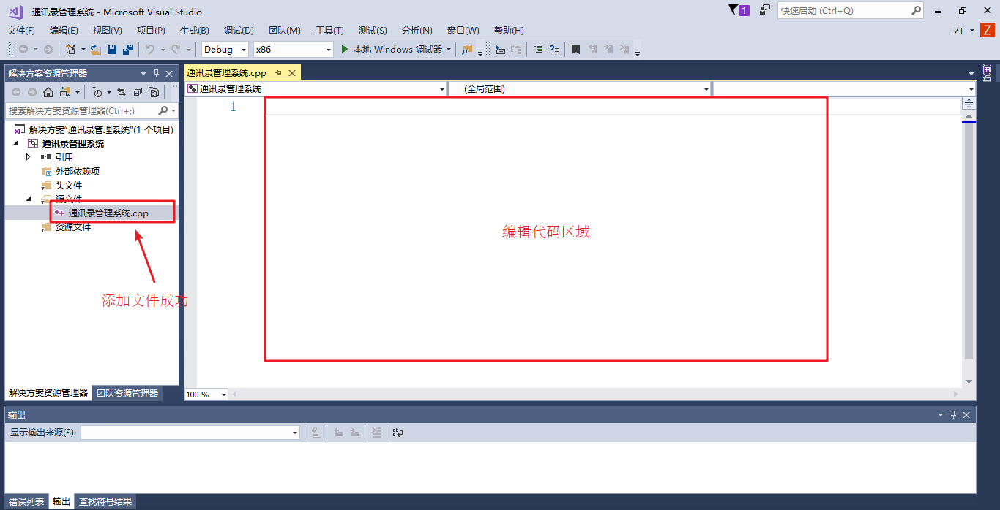

# 通讯录管理系统

---

## 系统需求

通讯录是一个可以记录亲人、好友信息的工具

本教程主要利用 C++ 来实现一个通讯录管理系统

系统中需要实现的功能如下：

* 添加联系人：向通讯录中添加新人，信息包括(姓名、性别、年龄、联系电话、家庭住址)最多记录 1000 人
* 显示联系人：显示通讯录中所有联系人信息
* 删除联系人：按照姓名进行删除指定联系人
* 查找联系人：按照姓名查看指定联系人信息
* 修改联系人：按照姓名重新修改指定联系人
* 清空联系人：清空通讯录中所有信息
* 退出通讯录：退出当前使用的通讯录

---

## 创建项目

创建项目步骤如下:

* 创建新项目
* 添加文件

### 创建项目

打开 vs 后，点击创建新项目，创建新的 C++ 项目


填写项目名称，选择项目路径


### 添加文件


添加成功后，效果如图



至此，项目已创建完毕

我们将项目拆分成三个文件，`mine.h`，`mine.cpp`，`main.cpp`

* `mine.h`，存放函数的定义
* `mine.cpp`，存放函数的实现
* `main.cpp`，主文件

`mine.h`

```cpp
#include <iostream>

using namespace std;

```

`mine.cpp`

```cpp
#include "mine.h"

// mine.cpp 文件

```

`main.cpp`

```cpp
#include <iostream>
#include "mine.h"

using namespace std;

int main()
{

    /*
     */

    return 0;
}
```

---

## 菜单功能

**功能描述**：用户选择功能的界面

菜单界面效果如下

```text
***************************
*****  1、添加联系人  *****
*****  2、显示联系人  *****
*****  3、删除联系人  *****
*****  4、查找联系人  *****
*****  5、修改联系人  *****
*****  6、清空联系人  *****
*****  0、退出通讯录  *****
***************************
* 请按上述提示输入一个数字 *
```

**步骤**:

* 封装函数显示该界面  如 `void showMenu()`
* 在 `main` 函数中调用封装好的函数

```cpp
void showMenu()
{
    cout << "***************************" << endl;
    cout << "*****  1、添加联系人  *****" << endl;
    cout << "*****  2、显示联系人  *****" << endl;
    cout << "*****  3、删除联系人  *****" << endl;
    cout << "*****  4、查找联系人  *****" << endl;
    cout << "*****  5、修改联系人  *****" << endl;
    cout << "*****  6、清空联系人  *****" << endl;
    cout << "*****  0、退出通讯录  *****" << endl;
    cout << "***************************" << endl;
    cout << "* 请按上述提示输入一个数字 *" << endl;
}
```

---

## 退出功能

**功能描述**：退出通讯录系统

**思路**：根据用户不同的选择，进入不同的功能，可以选择 `switch` 分支结构，将整个架构进行搭建

当用户选择 0 时候，执行退出，选择其他先不做操作，也不会退出程序

```cpp
void deal()
{
    int select = -1;
    while (true)
    {
        showMenu();
        cin >> select;
        switch (select)
        {
        case 1:
            // 添加联系人
            break;
        case 2:
            // 显示联系人
            break;
        case 3:
            // 删除联系人
            break;
        case 4:
            // 查找联系人
            break;
        case 5:
            // 修改联系人
            break;
        case 6:
            // 清空联系人
            break;
        case 0:
            // 退出通讯录
            cout << "欢迎下次使用!" << endl;
            return;
            break;
        default:
            break;
        }
    }
}
```

效果如下:

```text
***************************
*****  1、添加联系人  *****
*****  2、显示联系人  *****
*****  3、删除联系人  *****
*****  4、查找联系人  *****
*****  5、修改联系人  *****
*****  6、清空联系人  *****
*****  0、退出通讯录  *****
***************************
* 请按上述提示输入一个数字 *
1
***************************
*****  1、添加联系人  *****
*****  2、显示联系人  *****
*****  3、删除联系人  *****
*****  4、查找联系人  *****
*****  5、修改联系人  *****
*****  6、清空联系人  *****
*****  0、退出通讯录  *****
***************************
* 请按上述提示输入一个数字 *
0
欢迎下次使用!
```

---

## 添加联系人

**功能描述**：

实现添加联系人功能，联系人上限为 1000 人，联系人信息包括(姓名、性别、年龄、联系电话、家庭住址)

添加联系人实现步骤:

* 设计联系人结构体
* 设计通讯录结构体
* `main` 函数中创建通讯录
* 封装添加联系人函数
* 测试添加联系人功能

### 设计联系人结构体

联系人信息包括：姓名、性别、年龄、联系电话、家庭住址

设计如下：

```cpp
struct Person
{
    string name;
    int sex;
    int age;
    string phone;
    string address;
};
```

### 设计通讯录结构体

设计时候可以在通讯录结构体中，维护一个容量为 1000 的存放联系人的数组，并记录当前通讯录中联系人数量

设计如下:

```cpp
#define MAX 1000

struct AddressBook
{
    Person personArray[MAX];
    int size;
};
```

### main 函数中创建通讯录

添加联系人函数封装好后，在 `main` 函数中创建一个通讯录变量，这个就是需要一直维护的通讯录

```cpp
// 创建通讯录
AddressBook abs;
// 初始化通讯录中人数
abs.size = 0;
```

### 封装添加联系人函数

**思路**：添加联系人前先判断通讯录是否已满，如果满了就不再添加，未满情况将新联系人信息逐个加入到通讯录

添加联系人代码:

```cpp
void addPerson(AddressBook *abs)
{
    // 判断电话本是否满了
    if (abs->size >= MAX)
    {
        cout << "通讯录已满，无法添加!" << endl;
        return;
    }
    else
    {
        // 姓名
        string name;
        cout << "请输入姓名：" << endl;
        cin >> name;
        abs->personArray[abs->size].name = name;

        cout << "请输入性别：" << endl;
        cout << "1 -- 男" << endl;
        cout << "2 -- 女" << endl;

        // 性别
        int sex = 0;
        while (true)
        {
            cin >> sex;
            if (sex == 1 || sex == 2)
            {
                abs->personArray[abs->size].sex = sex;
                break;
            }
            cout << "输入有误，请重新输入";
        }

        // 年龄
        cout << "请输入年龄：" << endl;
        int age = 0;
        cin >> age;
        abs->personArray[abs->size].age = age;

        // 联系电话
        cout << "请输入联系电话：" << endl;
        string phone = "";
        cin >> phone;
        abs->personArray[abs->size].phone = phone;

        // 家庭住址
        cout << "请输入家庭住址：" << endl;
        string address;
        cin >> address;
        abs->personArray[abs->size].address = address;

        // 更新通讯录人数
        abs->size++;

        cout << "添加成功" << endl;

        // linux
        // system("clear");
        // windows
        // system("cls");
    }
}
```

### 测试添加联系人功能

选择界面中，如果玩家选择了 1，代表添加联系人，我们可以测试下该功能

在 `switch case` 语句中，`case 1` 里添加:

```cpp
case 1:
    // 添加联系人
    addPerson(abs);
    break;
```

测试效果如下:

```text
***************************
*****  1、添加联系人  *****
*****  2、显示联系人  *****
*****  3、删除联系人  *****
*****  4、查找联系人  *****
*****  5、修改联系人  *****
*****  6、清空联系人  *****
*****  0、退出通讯录  *****
***************************
* 请按上述提示输入一个数字 *
1
请输入姓名：
jack
请输入性别：
1 -- 男
2 -- 女
1
请输入年龄：
19
请输入联系电话：
13212344321
请输入家庭住址：
BeiJing
添加成功
***************************
*****  1、添加联系人  *****
*****  2、显示联系人  *****
*****  3、删除联系人  *****
*****  4、查找联系人  *****
*****  5、修改联系人  *****
*****  6、清空联系人  *****
*****  0、退出通讯录  *****
***************************
* 请按上述提示输入一个数字 *
0
欢迎下次使用!
```

---

## 显示联系人

**功能描述**：显示通讯录中已有的联系人信息

显示联系人实现步骤:

* 封装显示联系人函数
* 测试显示联系人功能

### 封装显示联系人函数

**思路**：判断如果当前通讯录中没有人员，就提示记录为空，人数大于 0，显示通讯录中信息

显示联系人代码：

```cpp
void showPerson(const AddressBook *abs)
{
    if (abs->size <= 0)
    {
        cout << "当前记录为空" << endl;
    }
    else
    {
        for (int i = 0; i < abs->size; i++)
        {
            cout << "姓名：" << abs->personArray[i].name << "\t";
            cout << "性别：" << (abs->personArray[i].sex == 1 ? "男" : "女") << "\t";
            cout << "年龄：" << abs->personArray[i].age << "\t";
            cout << "电话：" << abs->personArray[i].phone << "\t";
            cout << "住址：" << abs->personArray[i].address << endl;
        }
    }
}
```

### 测试显示联系人功能

在 `switch case` 语句中，`case 2` 里添加

```cpp
case 2:
    // 显示联系人
    showPerson(abs);
    break;
```

测试效果如下:

```text
***************************
*****  1、添加联系人  *****
*****  2、显示联系人  *****
*****  3、删除联系人  *****
*****  4、查找联系人  *****
*****  5、修改联系人  *****
*****  6、清空联系人  *****
*****  0、退出通讯录  *****
***************************
* 请按上述提示输入一个数字 *
2
当前记录为空
***************************
*****  1、添加联系人  *****
*****  2、显示联系人  *****
*****  3、删除联系人  *****
*****  4、查找联系人  *****
*****  5、修改联系人  *****
*****  6、清空联系人  *****
*****  0、退出通讯录  *****
***************************
* 请按上述提示输入一个数字 *
1
请输入姓名：
jack
请输入性别：
1 -- 男
2 -- 女
1
请输入年龄：
21
请输入联系电话：
14212344321
请输入家庭住址：
BeiJing
添加成功
***************************
*****  1、添加联系人  *****
*****  2、显示联系人  *****
*****  3、删除联系人  *****
*****  4、查找联系人  *****
*****  5、修改联系人  *****
*****  6、清空联系人  *****
*****  0、退出通讯录  *****
***************************
* 请按上述提示输入一个数字 *
2
姓名：jack      性别：男        年龄：21        电话：14212344321       住址：BeiJing
***************************
*****  1、添加联系人  *****
*****  2、显示联系人  *****
*****  3、删除联系人  *****
*****  4、查找联系人  *****
*****  5、修改联系人  *****
*****  6、清空联系人  *****
*****  0、退出通讯录  *****
***************************
* 请按上述提示输入一个数字 *
0
欢迎下次使用!
```

---

## 删除联系人

**功能描述**：按照姓名进行删除指定联系人

删除联系人实现步骤:

* 封装检测联系人是否存在
* 封装删除联系人函数
* 测试删除联系人功能

### 封装检测联系人是否存在

**设计思路**:

* 删除联系人前，我们需要先判断用户输入的联系人是否存在，如果存在删除，不存在提示用户没有要删除的联系人
* 因此我们可以把检测联系人是否存在封装成一个函数中，如果存在，返回联系人在通讯录中的位置，不存在返回 -1

检测联系人是否存在代码：

```cpp
int isExist(const AddressBook *abs, string name)
{
    for (int i = 0; i < abs->size; i++)
    {
        if (abs->personArray[i].name == name)
        {
            return i;
        }
    }
    return -1;
}
```

### 封装删除联系人函数

根据用户输入的联系人判断该通讯录中是否有此人:

* 查找到进行删除，并提示删除成功
* 查不到提示查无此人

```cpp
void deletePerson(AddressBook *abs)
{
    cout << "请输入您要删除的联系人" << endl;
    string name;
    cin >> name;

    int ret = isExist(abs, name);
    if (ret != -1)
    {
        for (int i = ret; i < abs->size; i++)
        {
            abs->personArray[i] = abs->personArray[i + 1];
        }
        abs->size--;
        cout << "删除成功" << endl;
    }
    else
    {
        cout << "查无此人" << endl;
    }
}
```

### 测试删除联系人功能

在 `switch case` 语句中，`case 3` 里添加:

```cpp
case 3:
    // 删除联系人
    deletePerson(abs);
    break;
```

测试效果如图:

* 存在情况:

```text
***************************
*****  1、添加联系人  *****
*****  2、显示联系人  *****
*****  3、删除联系人  *****
*****  4、查找联系人  *****
*****  5、修改联系人  *****
*****  6、清空联系人  *****
*****  0、退出通讯录  *****
***************************
* 请按上述提示输入一个数字 *
3
请输入您要删除的联系人
Jack
删除成功
```

* 不存在情况:

```text
***************************
*****  1、添加联系人  *****
*****  2、显示联系人  *****
*****  3、删除联系人  *****
*****  4、查找联系人  *****
*****  5、修改联系人  *****
*****  6、清空联系人  *****
*****  0、退出通讯录  *****
***************************
* 请按上述提示输入一个数字 *
3
请输入您要删除的联系人
Mark
查无此人
```

---

## 查找联系人

**功能描述**：按照姓名查看指定联系人信息

查找联系人实现步骤:

* 封装查找联系人函数
* 测试查找指定联系人

### 封装查找联系人函数

**实现思路**：判断用户指定的联系人是否存在，如果存在显示信息，不存在则提示查无此人

查找联系人代码:

```cpp
void findPerson(const AddressBook *abs)
{
    cout << "请输入您要查找的联系人" << endl;
    string name;
    cin >> name;

    int ret = isExist(abs, name);
    if (ret != -1)
    {
        cout << "姓名：" << abs->personArray[ret].name << "\t";
        cout << "性别：" << abs->personArray[ret].sex << "\t";
        cout << "年龄：" << abs->personArray[ret].age << "\t";
        cout << "电话：" << abs->personArray[ret].phone << "\t";
        cout << "住址：" << abs->personArray[ret].address << endl;
    }
    else
    {
        cout << "查无此人" << endl;
    }
}
```

### 测试查找指定联系人

在 `switch case` 语句中，`case 4` 里添加:

```cpp
case 4:
    // 查找联系人
    findPerson(abs);
    break;
```

测试效果如下

* 存在情况

```text
***************************
*****  1、添加联系人  *****
*****  2、显示联系人  *****
*****  3、删除联系人  *****
*****  4、查找联系人  *****
*****  5、修改联系人  *****
*****  6、清空联系人  *****
*****  0、退出通讯录  *****
***************************
* 请按上述提示输入一个数字 *
4
请输入您要查找的联系人
Jack
姓名：Jack      性别：1 年龄：17        电话：13112344321       住址：BeiJing
```

* 不存在情况

```text
***************************
*****  1、添加联系人  *****
*****  2、显示联系人  *****
*****  3、删除联系人  *****
*****  4、查找联系人  *****
*****  5、修改联系人  *****
*****  6、清空联系人  *****
*****  0、退出通讯录  *****
***************************
* 请按上述提示输入一个数字 *
4    
请输入您要查找的联系人
mark
查无此人
```

---

## 修改联系人

**功能描述**：按照姓名重新修改指定联系人

修改联系人实现步骤:

* 封装修改联系人函数
* 测试修改联系人功能

### 封装修改联系人函数

**实现思路**：查找用户输入的联系人，如果查找成功进行修改操作，查找失败提示查无此人

修改联系人代码:

```cpp
void modifyPerson(AddressBook *abs)
{
    cout << "请输入您要修改的联系人" << endl;
    string name;
    cin >> name;

    int ret = isExist(abs, name);
    if (ret != -1)
    {
        // 姓名
        string name;
        cout << "请输入姓名：" << endl;
        cin >> name;
        abs->personArray[ret].name = name;

        cout << "请输入性别：" << endl;
        cout << "1 -- 男" << endl;
        cout << "2 -- 女" << endl;

        // 性别
        int sex = 0;
        while (true)
        {
            cin >> sex;
            if (sex == 1 || sex == 2)
            {
                abs->personArray[ret].sex = sex;
                break;
            }
            cout << "输入有误，请重新输入";
        }

        // 年龄
        cout << "请输入年龄：" << endl;
        int age = 0;
        cin >> age;
        abs->personArray[ret].age = age;

        // 联系电话
        cout << "请输入联系电话：" << endl;
        string phone;
        cin >> phone;
        abs->personArray[ret].phone = phone;

        // 家庭住址
        cout << "请输入家庭住址：" << endl;
        string address;
        cin >> address;
        abs->personArray[ret].address = address;

        cout << "修改成功" << endl;
    }
    else
    {
        cout << "查无此人" << endl;
    }
}
```

### 测试修改联系人功能

在 `switch case` 语句中，`case 5` 里添加：

```cpp
case 5:
    // 修改联系人
    modifyPerson(abs);
    break;
```

测试效果如图:

* 查不到指定联系人情况:

```text
***************************
*****  1、添加联系人  *****
*****  2、显示联系人  *****
*****  3、删除联系人  *****
*****  4、查找联系人  *****
*****  5、修改联系人  *****
*****  6、清空联系人  *****
*****  0、退出通讯录  *****
***************************
* 请按上述提示输入一个数字 *
5
请输入您要修改的联系人
Mark
查无此人
```

* 查找到联系人，并修改成功:

```text
***************************
*****  1、添加联系人  *****
*****  2、显示联系人  *****
*****  3、删除联系人  *****
*****  4、查找联系人  *****
*****  5、修改联系人  *****
*****  6、清空联系人  *****
*****  0、退出通讯录  *****
***************************
* 请按上述提示输入一个数字 *
5
请输入您要修改的联系人
Jack
请输入姓名：
Jacker
请输入性别：
1 -- 男
2 -- 女
1
请输入年龄：
21
请输入联系电话：
12343211234
请输入家庭住址：
ChengDu
修改成功
```

* 再次查看通讯录，确认修改完毕:

```text
***************************
*****  1、添加联系人  *****
*****  2、显示联系人  *****
*****  3、删除联系人  *****
*****  4、查找联系人  *****
*****  5、修改联系人  *****
*****  6、清空联系人  *****
*****  0、退出通讯录  *****
***************************
* 请按上述提示输入一个数字 *
2
姓名：Jacker    性别：男        年龄：21        电话：12343211234       住址：ChengDu
```

---

## 清空联系人

**功能描述**：清空通讯录中所有信息

清空联系人实现步骤

* 封装清空联系人函数
* 测试清空联系人

### 封装清空联系人函数

**实现思路**： 将通讯录所有联系人信息清除掉，只要将通讯录记录的联系人数量置为 0，做逻辑清空即可

清空联系人代码:

```cpp
void cleanPerson(AddressBook *abs)
{
    abs->size = 0;
    cout << "通讯录已清空" << endl;
}
```

### 测试清空联系人

在 `switch case` 语句中，`case 6` 里添加:

```cpp
case 6:
    // 清空联系人
    cleanPerson(abs);
    break;
```

测试效果如下:

* 清空通讯录

```text
***************************
*****  1、添加联系人  *****
*****  2、显示联系人  *****
*****  3、删除联系人  *****
*****  4、查找联系人  *****
*****  5、修改联系人  *****
*****  6、清空联系人  *****
*****  0、退出通讯录  *****
***************************
* 请按上述提示输入一个数字 *
6
通讯录已清空
```

* 再次查看信息，显示记录为空

```text
***************************
*****  1、添加联系人  *****
*****  2、显示联系人  *****
*****  3、删除联系人  *****
*****  4、查找联系人  *****
*****  5、修改联系人  *****
*****  6、清空联系人  *****
*****  0、退出通讯录  *****
***************************
* 请按上述提示输入一个数字 *
2
当前记录为空
```

**至此，通讯录管理系统完成！**

---
