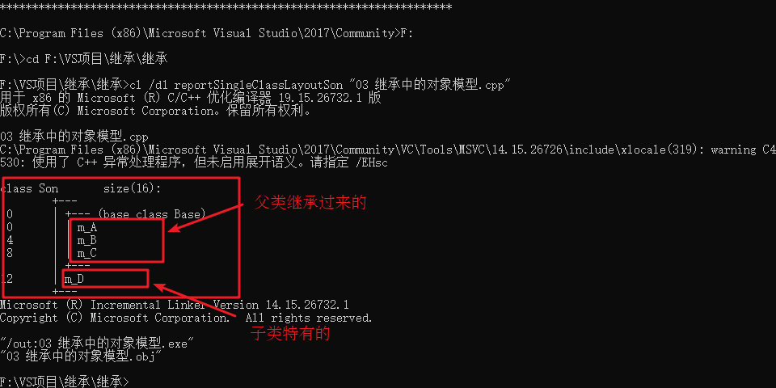

# 继承

**继承是面向对象三大特性之一**

有些类与类之间存在特殊的关系，例如下图中：


我们发现，定义这些类时，下级别的成员除了拥有上一级的共性，还有自己的特性。

这个时候就可以考虑利用继承的技术，减少重复代码

---

## 继承的基本语法

例如很多网站中，都有公共的头部，公共的底部，甚至公共的左侧列表，只有中心内容不同

接下来分别利用普通写法和继承的写法来实现网页中的内容，看一下继承存在的意义以及好处

**普通实现**:

code:

```cpp
#include <iostream>

using namespace std;

// Java 页面
class Java
{
public:
    void header()
    {
        cout << "首页、公开课、登录、注册...(公共头部)" << endl;
    }
    void footer()
    {
        cout << "帮助中心、交流合作、站内地图...(公共底部)" << endl;
    }
    void left()
    {
        cout << "Java，Python，C++...(公共分类列表)" << endl;
    }
    void content()
    {
        cout << "JAVA 学科视频" << endl;
    }
};

// Python 页面
class Python
{
public:
    void header()
    {
        cout << "首页、公开课、登录、注册...(公共头部)" << endl;
    }
    void footer()
    {
        cout << "帮助中心、交流合作、站内地图...(公共底部)" << endl;
    }
    void left()
    {
        cout << "Java，Python，C++...(公共分类列表)" << endl;
    }
    void content()
    {
        cout << "Python 学科视频" << endl;
    }
};

// C++ 页面
class CPP
{
public:
    void header()
    {
        cout << "首页、公开课、登录、注册...(公共头部)" << endl;
    }
    void footer()
    {
        cout << "帮助中心、交流合作、站内地图...(公共底部)" << endl;
    }
    void left()
    {
        cout << "Java，Python，C++...(公共分类列表)" << endl;
    }
    void content()
    {
        cout << "C++ 学科视频" << endl;
    }
};

void test01()
{
    // Java 页面
    cout << "Java 下载视频页面如下： " << endl;
    Java ja;
    ja.header();
    ja.footer();
    ja.left();
    ja.content();
    cout << "--------------------" << endl;

    // Python 页面
    cout << "Python 下载视频页面如下： " << endl;
    Python py;
    py.header();
    py.footer();
    py.left();
    py.content();
    cout << "--------------------" << endl;

    // C++ 页面
    cout << "C++ 下载视频页面如下： " << endl;
    CPP cp;
    cp.header();
    cp.footer();
    cp.left();
    cp.content();
}

int main()
{
    test01();

    /*
        Java 下载视频页面如下：
        首页、公开课、登录、注册...(公共头部)
        帮助中心、交流合作、站内地图...(公共底部)
        Java，Python，C++...(公共分类列表)
        JAVA 学科视频
        --------------------
        Python 下载视频页面如下：
        首页、公开课、登录、注册...(公共头部)
        帮助中心、交流合作、站内地图...(公共底部)
        Java，Python，C++...(公共分类列表)
        Python 学科视频
        --------------------
        C++ 下载视频页面如下：
        首页、公开课、登录、注册...(公共头部)
        帮助中心、交流合作、站内地图...(公共底部)
        Java，Python，C++...(公共分类列表)
        C++ 学科视频
    */

    return 0;
}
```

**继承实现**:

code:

```cpp
#include <iostream>

using namespace std;

// 公共页面
class BasePage
{
public:
    void header()
    {
        cout << "首页、公开课、登录、注册...(公共头部)" << endl;
    }

    void footer()
    {
        cout << "帮助中心、交流合作、站内地图...(公共底部)" << endl;
    }
    void left()
    {
        cout << "Java，Python，C++...(公共分类列表)" << endl;
    }
};

// Java 页面
class Java : public BasePage
{
public:
    void content()
    {
        cout << "JAVA 学科视频" << endl;
    }
};

// Python 页面
class Python : public BasePage
{
public:
    void content()
    {
        cout << "Python 学科视频" << endl;
    }
};

// C++ 页面
class CPP : public BasePage
{
public:
    void content()
    {
        cout << "C++ 学科视频" << endl;
    }
};

void test1()
{
    // Java页面
    cout << "Java 下载视频页面如下： " << endl;
    Java ja;
    ja.header();
    ja.footer();
    ja.left();
    ja.content();
    cout << "--------------------" << endl;

    // Python 页面
    cout << "Python 下载视频页面如下： " << endl;
    Python py;
    py.header();
    py.footer();
    py.left();
    py.content();
    cout << "--------------------" << endl;

    // C++ 页面
    cout << "C++ 下载视频页面如下： " << endl;
    CPP cp;
    cp.header();
    cp.footer();
    cp.left();
    cp.content();
}

int main()
{
    test1();

    /*
        Java 下载视频页面如下：
        首页、公开课、登录、注册...(公共头部)
        帮助中心、交流合作、站内地图...(公共底部)
        Java，Python，C++...(公共分类列表)
        JAVA 学科视频
        --------------------
        Python 下载视频页面如下：
        首页、公开课、登录、注册...(公共头部)
        帮助中心、交流合作、站内地图...(公共底部)
        Java，Python，C++...(公共分类列表)
        Python 学科视频
        --------------------
        C++ 下载视频页面如下：
        首页、公开课、登录、注册...(公共头部)
        帮助中心、交流合作、站内地图...(公共底部)
        Java，Python，C++...(公共分类列表)
        C++ 学科视频
    */

    return 0;
}
```

**总结**:

继承的好处：**可以减少重复的代码**

```cpp
class A : public B
{

};
```

其中

* `A` 类称为子类或派生类
* `B` 类称为父类或基类

派生类中的成员，包含两大部分:

* 一类是从基类继承过来的
* 一类是自己增加的成员

从基类继承过过来的表现其共性，而新增的成员体现了其个性

---

## 继承方式

继承的语法：

```cpp
class 子类 : 继承方式 父类
{

};
```

继承方式一共有三种:

* 公共继承
* 保护继承
* 私有继承


demo:

```cpp
#include <iostream>

using namespace std;

class Base
{
public:
    int m_A;

protected:
    int m_B;

private:
    int m_C;
};

// 公共继承
class Son1 : public Base
{
public:
    void func()
    {
        m_A; // 可访问 public 权限
        m_B; // 可访问 protected 权限
        // m_C; // 不可访问
    }
};

void myClass()
{
    Son1 s1;
    s1.m_A; // 其他类只能访问到公共权限
}

// 保护继承
class Son2 : protected Base
{
public:
    void func()
    {
        m_A; // 可访问 protected 权限
        m_B; // 可访问 protected 权限
        // m_C; // 不可访问
    }
};

void myClass2()
{
    Son2 s;
    // s.m_A; // 不可访问
}

// 私有继承
class Son3 : private Base
{
public:
    void func()
    {
        m_A; // 可访问 private 权限
        m_B; // 可访问 private 权限
        // m_C; // 不可访问
    }
};

class GrandSon3 : public Son3
{
public:
    void func()
    {
        // Son3 是私有继承，所以继承 Son3 的属性在 GrandSon3 中都无法访问到
        // m_A;
        // m_B;
        // m_C;
    }
};

int main()
{

    /*
     */

    return 0;
}
```

---

## 继承中的对象模型

**问题**：从父类继承过来的成员，哪些属于子类对象中？

demo:

```cpp
#include <iostream>

using namespace std;

class Base
{
public:
    int m_A;

protected:
    int m_B;

private:
    int m_C; // 私有成员只是被隐藏了，但是还是会继承下去
};

// 公共继承
class Son : public Base
{
public:
    int m_D;
};

void test1()
{
    cout << "sizeof Son = " << sizeof(Son) << endl;
}

int main()
{
    test1();

    /*
        sizeof Son = 16
    */

    return 0;
}
```

利用工具查看:


打开工具窗口后，定位到当前 CPP 文件的盘符

然后输入:

```cpp
cl /d1 reportSingleClassLayout查看的类名 所属文件名
```



windows vs 2022 效果如下:

```shell
C:\Users\xxx\Desktop\ConsoleApplication1\ConsoleApplication1>cl /d1 reportSingleClassLayoutSon ConsoleApplication1.cpp
用于 x64 的 Microsoft (R) C/C++ 优化编译器 19.32.31332 版
版权所有(C) Microsoft Corporation。保留所有权利。

ConsoleApplication1.cpp

class Son       size(16):
        +---
 0      | +--- (base class Base)
 0      | | m_A
 4      | | m_B
 8      | | m_C
        | +---
12      | m_D
        +---
F:\Program Files\Microsoft Visual Studio\2022\Community\VC\Tools\MSVC\14.32.31326\include\ostream(374): warning C4530: 使用了 C++ 异常处理程序，但未启 用展开语义。请指定 /EHsc
F:\Program Files\Microsoft Visual Studio\2022\Community\VC\Tools\MSVC\14.32.31326\include\ostream(367): note: 在编译 类 模板 成员函数“std::basic_ostream<char,std::char_traits<char>> &std::basic_ostream<char,std::char_traits<char>>::operator <<(unsigned __int64)”时
ConsoleApplication1.cpp(26): note: 查看对正在编译的函数 模板 实例化“std::basic_ostream<char,std::char_traits<char>> &std::basic_ostream<char,std::char_traits<char>>::operator <<(unsigned __int64)”的引用
ConsoleApplication1.cpp(26): note: 查看对正在编译的 类 模板 实例化“std::basic_ostream<char,std::char_traits<char>>”的引用
Microsoft (R) Incremental Linker Version 14.32.31332.0
Copyright (C) Microsoft Corporation.  All rights reserved.

/out:ConsoleApplication1.exe
ConsoleApplication1.obj
```

linux g++ 效果如下:

```text
Before gcc 8.0: -fdump-class-hierarchy; after 8.0: -fdump-lang-class
```

```shell
$ g++ -fdump-lang-class -o main main.cpp
```

生成了一个 `main.cpp.001l.class` 文件:

查看 `Son` 可以发现:

```cpp
...
Class Base
   size=12 align=4
   base size=12 base align=4
Base (0x0x7f54c5107f60) 0

Class Son
   size=16 align=4
   base size=16 base align=4
Son (0x0x7f54c4d5d1a0) 0
  Base (0x0x7f54c4d62000) 0
...
```

> 结论：父类中所有非静态成员属性都会被子类继承下去，父类中私有成员也是被子类继承下去了，只是由编译器给隐藏后访问不到

---

## 继承中构造和析构顺序

子类继承父类后，当创建子类对象，也会调用父类的构造函数

问题：父类和子类的构造和析构顺序是谁先谁后？

demo:

```cpp
#include <iostream>

using namespace std;

class Base
{
public:
    Base()
    {
        cout << "Base 构造函数!" << endl;
    }
    ~Base()
    {
        cout << "Base 析构函数!" << endl;
    }
};

class Son : public Base
{
public:
    Son()
    {
        cout << "Son 构造函数!" << endl;
    }
    ~Son()
    {
        cout << "Son 析构函数!" << endl;
    }
};

void test1()
{
    // 继承中，先调用父类构造函数，再调用子类构造函数，析构顺序与构造相反
    Son s;
}

int main()
{
    test1();

    /*
        Base 构造函数!
        Son 构造函数!
        Son 析构函数!
        Base 析构函数!
    */

    return 0;
}
```

> 总结：继承中，先调用父类构造函数，再调用子类构造函数，析构顺序与构造相反

---

## 继承同名成员处理方式

问题：当子类与父类出现同名的成员，如何通过子类对象，访问到子类或父类中同名的数据呢？

* 访问子类同名成员，直接访问即可
* 访问父类同名成员，需要加作用域

demo:

```cpp
#include <iostream>

using namespace std;

class Base
{
public:
    int m_A;

public:
    Base()
    {
        this->m_A = 100;
    }

    void func()
    {
        cout << "Base - func() 调用" << endl;
    }

    void func(int a)
    {
        cout << "Base - func(int a) 调用" << endl;
    }
};

class Son : public Base
{
public:
    int m_A;

public:
    Son()
    {
        this->m_A = 200;
    }

    // 当子类与父类拥有同名的成员函数，子类会隐藏父类中所有版本的同名成员函数
    // 如果想访问父类中被隐藏的同名成员函数，需要加父类的作用域
    void func()
    {
        cout << "Son - func() 调用" << endl;
    }

    void func(int a)
    {
        cout << "Son - func(int a) 调用" << endl;
    }
};

void test1()
{
    Son s;

    cout << "Son 下的 m_A = " << s.m_A << endl;
    cout << "Base 下的 m_A = " << s.Base::m_A << endl;

    s.func();
    s.func(10);
    s.Base::func();
    s.Base::func(10);
}
int main()
{
    test1();

    /*
        Son 下的 m_A = 200
        Base 下的 m_A = 100
        Son - func() 调用
        Son - func(int a) 调用
        Base - func() 调用
        Base - func(int a) 调用
    */

    return EXIT_SUCCESS;
}
```

总结：

* 子类对象可以直接访问到子类中同名成员
* 子类对象加作用域可以访问到父类同名成员
* 当子类与父类拥有同名的成员函数，子类会隐藏父类中同名成员函数，加作用域可以访问到父类中同名函数

---

## 继承同名静态成员处理方式

问题：继承中同名的静态成员在子类对象上如何进行访问？

静态成员和非静态成员出现同名，处理方式一致

* 访问子类同名成员，直接访问即可
* 访问父类同名成员，需要加作用域

demo:

```cpp
#include <iostream>

using namespace std;

class Base
{
public:
    static int m_A;

public:
    static void func()
    {
        cout << "Base - static void func()" << endl;
    }
    static void func(int a)
    {
        cout << "Base - static void func(int a)" << endl;
    }
};

int Base::m_A = 100;

class Son : public Base
{
public:
    static int m_A;

public:
    static void func()
    {
        cout << "Son - static void func()" << endl;
    }
};

int Son::m_A = 200;

// 同名成员属性
void test1()
{
    // 通过对象访问
    cout << "通过对象访问： " << endl;
    Son s;
    cout << "Son  下 m_A = " << s.m_A << endl;
    cout << "Base 下 m_A = " << s.Base::m_A << endl;

    // 通过类名访问
    cout << "通过类名访问： " << endl;
    cout << "Son  下 m_A = " << Son::m_A << endl;
    cout << "Base 下 m_A = " << Son::Base::m_A << endl;
}

// 同名成员函数
void test2()
{
    // 通过对象访问
    cout << "通过对象访问： " << endl;
    Son s;
    s.func();
    s.Base::func();

    // 通过类名访问
    cout << "通过类名访问： " << endl;
    Son::func();
    Son::Base::func();
    // 出现同名，子类会隐藏掉父类中所有同名成员函数，需要加作作用域访问
    Son::Base::func(100);
}
int main()
{
    test1();
    cout << "======" << endl;
    test2();

    /*
        通过对象访问：
        Son  下 m_A = 200
        Base 下 m_A = 100
        通过类名访问：
        Son  下 m_A = 200
        Base 下 m_A = 100
        ======
        通过对象访问：
        Son - static void func()
        Base - static void func()
        通过类名访问：
        Son - static void func()
        Base - static void func()
        Base - static void func(int a)
    */

    return 0;
}
```

> 总结：同名静态成员处理方式和非静态处理方式一样，只不过有两种访问的方式(通过对象和通过类名)

---

## 多继承语法

C++ 允许 **一个类继承多个类**

**语法**：

```cpp
class 子类 : 继承方式 父类 1, 继承方式 父类 2,...
{

};
```

多继承可能会引发父类中有同名成员出现，需要加作用域区分

**C++ 实际开发中不建议用多继承**，java 就不支持多继承类

demo:

```cpp
#include <iostream>

using namespace std;

class Base1
{
public:
    int m_A;

public:
    Base1()
    {
        m_A = 100;
    }
};

class Base2
{
public:
    int m_A;

public:
    Base2()
    {
        m_A = 200; // 开始是 m_B 不会出问题，但是改为 m_A 就会出现不明确
    }
};

// 语法：class 子类 : 继承方式 父类 1, 继承方式 父类 2...
class Son : public Base2, public Base1
{
public:
    int m_C;
    int m_D;

public:
    Son()
    {
        m_C = 300;
        m_D = 400;
    }
    void show()
    {
        cout << Base1::m_A << " " << Base2::m_A << " " << this->m_C << " " << this->m_D << endl;
    }
};

// 多继承容易产生成员同名的情况
// 通过使用类名作用域可以区分调用哪一个基类的成员
void test1()
{
    Son s;
    cout << "sizeof Son = " << sizeof(s) << endl;
    cout << s.Base1::m_A << endl;
    cout << s.Base2::m_A << endl;
    cout << s.m_C << endl;
    cout << s.m_D << endl;
    cout << "========" << endl;
    s.show();
}

int main()
{
    test1();

    /*
        sizeof Son = 16
        100
        200
        300
        400
        ========
        100 200 300 400
    */

    return 0;
}
```

> 总结：多继承中如果父类中出现了同名情况，子类使用时候要加作用域

---

## 菱形继承
​
**菱形继承概念**:

* 两个派生类继承同一个基类
* 又有某个类同时继承者两个派生类
* 这种继承被称为菱形继承，或者钻石继承

**典型的菱形继承案例**:


**菱形继承问题**：

* 羊继承了动物的数据，驼同样继承了动物的数据，当羊驼使用数据时，就会产生二义性
* 羊驼继承自动物的数据继承了两份，其实我们应该清楚，这份数据只需要一份就可以

demo:

```cpp
#include <iostream>

using namespace std;

class Animal
{
public:
    int age;
};

class Sheep : public Animal
{
};

class Tuo : public Animal
{
};

class SheepTuo : public Sheep, public Tuo
{
};

// 继承前加 virtual 关键字后，变为虚继承
// 此时公共的父类 Animal 称为虚基类
class Sheep1 : virtual public Animal
{
};

class Tuo1 : virtual public Animal
{
};

class SheepTuo1 : public Sheep1, public Tuo1
{
};

void test1()
{
    SheepTuo st;
    st.Sheep::age = 18;
    st.Tuo::age = 21;

    cout << "sizeof(SheepTuo) = " << sizeof(SheepTuo) << endl;
    cout << "st.Sheep::age = " << st.Sheep::age << endl;
    cout << "st.Tuo::age = " << st.Tuo::age << endl;
}

void test2()
{
    SheepTuo1 st;
    st.Sheep1::age = 18;
    st.Tuo1::age = 21;

    cout << "sizeof(Animal) = " << sizeof(Animal) << endl;
    cout << "sizeof(Sheep1) = " << sizeof(Sheep1) << endl;
    cout << "sizeof(Tuo1) = " << sizeof(Tuo1) << endl;
    cout << "sizeof(SheepTuo1) = " << sizeof(SheepTuo1) << endl;
    cout << "st.Sheep1::age = " << st.Sheep1::age << endl;
    cout << "st.Tuo1::age = " << st.Tuo1::age << endl;
    cout << "st.age = " << st.age << endl;
}

int main()
{
    test1();
    cout << "======" << endl;
    test2();

    /*
        sizeof(SheepTuo) = 8
        st.Sheep::age = 18
        st.Tuo::age = 21
        ======
        sizeof(Animal) = 4
        sizeof(Sheep1) = 16
        sizeof(Tuo1) = 16
        sizeof(SheepTuo1) = 24
        st.Sheep1::age = 21
        st.Tuo1::age = 21
        st.age = 21
    */

    return 0;
}
```

这里补充类大小的计算方式:

* 空类的大小为 1 字节
* 一个类中，虚函数本身、成员函数(包括静态与非静态)和静态数据成员都是不占用类对象的存储空间，也就是非静态数据成员才参与计算
* 对于包含虚函数的类，不管有多少个虚函数，只有一个虚指针 `vptr` 的大小
* 普通继承，派生类继承了所有基类的函数与成员，要按照字节对齐来计算大小
* 虚函数继承，不管是单继承还是多继承，都是继承了基类的 `vptr`(32 位操作系统 4 字节，64 位操作系统 8 字节)
* 虚继承，继承基类的 `vptr`

回到上述代码:

`sizeof(SheepTuo) = 8` 这个很好理解，对于 `sizeof(Sheep1) = 16`

`Sheep1` 是虚继承的，有一个 `vptr`，8 个字节，继承的 `age` 有 4 个字节，安装字节对齐原则，为 16 字节

而对于 `sizeof(SheepTuo1) = 24`，`SheepTuo1` 继承了 `Sheep1` 与 `Tuo1`，因而含有两个 `vptr`，16 个字节，还有一个 `age`，4 个字节，按照字节对齐原则，24 字节

**总结**：

* 菱形继承带来的主要问题是子类继承两份相同的数据，导致资源浪费以及毫无意义
* 利用虚继承可以解决菱形继承问题

---
