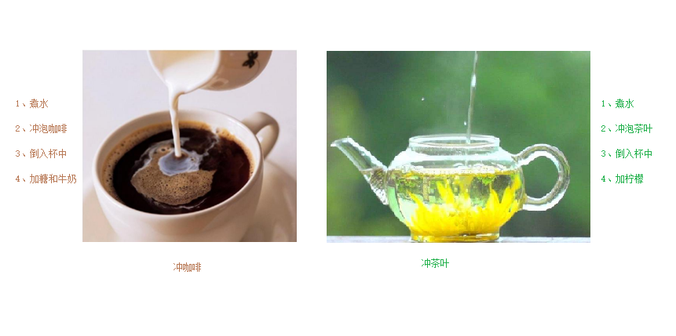

# 多态

**多态是 C++ 面向对象三大特性之一**

---

## 多态的基本概念

多态分为两类

* 静态多态: 函数重载和运算符重载属于静态多态，复用函数名
* 动态多态: 派生类和虚函数实现运行时多态

静态多态和动态多态区别：

* 静态多态的函数地址早绑定 - 编译阶段确定函数地址
* 动态多态的函数地址晚绑定 - 运行阶段确定函数地址

下面通过案例进行讲解多态

demo:

```cpp
#include <iostream>

using namespace std;

class Animal
{
public:
    // Speak 函数就是虚函数
    // 函数前面加上 virtual 关键字，变成虚函数，那么编译器在编译的时候就不能确定函数调用了
    virtual void speak()
    {
        cout << "动物在说话" << endl;
    }
};

class Cat : public Animal
{
public:
    void speak()
    {
        cout << "小猫在说话" << endl;
    }
};

class Dog : public Animal
{
public:
    void speak()
    {
        cout << "小狗在说话" << endl;
    }
};

// 我们希望传入什么对象，那么就调用什么对象的函数
// 如果函数地址在编译阶段就能确定，那么静态联编，早绑定
// 如果函数地址在运行阶段才能确定，就是动态联编，晚绑定
void doSpeak(Animal &animal)
{
    animal.speak();
}

// 多态满足条件：
// 有继承关系
// 子类重写父类中的虚函数
// 多态使用：
// 父类指针或引用指向子类对象
void test1()
{
    Animal a;
    doSpeak(a);

    Cat cat;
    doSpeak(cat);

    Dog dog;
    doSpeak(dog);
}

int main()
{
    test1();

    /*
        动物在说话
        小猫在说话
        小狗在说话
    */

    // 如果去掉 virtual

    /*
        动物在说话
        动物在说话
        动物在说话
    */

    return 0;
}
```

**总结**：

* 多态满足条件
    * 有继承关系
    * 子类重写父类中的虚函数
* 多态使用条件
    * 父类指针或引用指向子类对象

**重写**：

```cpp
函数返回值类型 函数名(参数列表)
{

}
```

完全一致称为重写

可以使用 vs 的开发者工具查看上述代码中类的内存对象模型，如虚函数表，虚函数指针以及使用 `virtual` 与否时类的内存变化情况等

---

## 多态案例一 -- 计算器类

**案例描述**：

分别利用普通写法和多态技术，设计实现两个操作数进行运算的计算器类

多态的优点:

* 代码组织结构清晰
* 可读性强
* 利于前期和后期的扩展以及维护

demo:

```cpp
#include <iostream>

using namespace std;

// 普通实现
class Calculator
{
public:
    int m_Num1;
    int m_Num2;

public:
    int getResult(string oper)
    {
        if (oper == "+")
        {
            return m_Num1 + m_Num2;
        }
        else if (oper == "-")
        {
            return m_Num1 - m_Num2;
        }
        else if (oper == "*")
        {
            return m_Num1 * m_Num2;
        }
        else
        {
            return -1;
        }
        // 如果要提供新的运算，需要修改源码
    }
};

void test1()
{
    // 普通实现测试
    Calculator c;
    c.m_Num1 = 10;
    c.m_Num2 = 10;

    cout << c.m_Num1 << " + " << c.m_Num2 << " = " << c.getResult("+") << endl;
    cout << c.m_Num1 << " - " << c.m_Num2 << " = " << c.getResult("-") << endl;
    cout << c.m_Num1 << " * " << c.m_Num2 << " = " << c.getResult("*") << endl;
}

// 多态实现
// 抽象计算器类
// 多态优点：代码组织结构清晰，可读性强，利于前期和后期的扩展以及维护
class AbstractCalculator
{
public:
    int m_Num1;
    int m_Num2;

public:
    virtual int getResult()
    {
        return 0;
    }
};

// 加法计算器
class AddCalculator : public AbstractCalculator
{
public:
    int getResult()
    {
        return m_Num1 + m_Num2;
    }
};

// 减法计算器
class SubCalculator : public AbstractCalculator
{
public:
    int getResult()
    {
        return m_Num1 - m_Num2;
    }
};

// 乘法计算器
class MulCalculator : public AbstractCalculator
{
public:
    int getResult()
    {
        return m_Num1 * m_Num2;
    }
};

void test2()
{
    AbstractCalculator *abc;
    // 创建加法计算器
    abc = new AddCalculator;
    abc->m_Num1 = 10;
    abc->m_Num2 = 10;
    cout << abc->m_Num1 << " + " << abc->m_Num2 << " = " << abc->getResult() << endl;
    delete abc; // 用完了记得销毁

    // 创建减法计算器
    abc = new SubCalculator;
    abc->m_Num1 = 10;
    abc->m_Num2 = 10;
    cout << abc->m_Num1 << " - " << abc->m_Num2 << " = " << abc->getResult() << endl;
    delete abc;

    // 创建乘法计算器
    abc = new MulCalculator;
    abc->m_Num1 = 10;
    abc->m_Num2 = 10;
    cout << abc->m_Num1 << " * " << abc->m_Num2 << " = " << abc->getResult() << endl;
    delete abc;
}

int main()
{
    test1();

    cout << "======" << endl;

    test2();

    /*
        10 + 10 = 20
        10 - 10 = 0
        10 * 10 = 100
        ======
        10 + 10 = 20
        10 - 10 = 0
        10 * 10 = 100
    */

    return 0;
}
```

> 总结：C++ 开发提倡利用多态设计程序架构，因为多态优点很多

---

## 纯虚函数和抽象类

在多态中，通常父类中虚函数的实现是毫无意义的，主要都是调用子类重写的内容

因此可以将虚函数改为 **纯虚函数**

纯虚函数语法：

```cpp
virtual 返回值类型 函数名 (参数列表) = 0;
```

当类中有了 **纯虚函数**，这个类也称为 **抽象类**

**抽象类特点**：

* 无法实例化对象
* 子类必须重写抽象类中所有的纯虚函数，否则也属于抽象类

demo:

```cpp
#include <iostream>

using namespace std;

class Base
{
public:
    // 纯虚函数
    // 类中只要有一个纯虚函数就称为抽象类
    // 抽象类无法实例化对象
    // 子类必须重写父类中的纯虚函数，否则也属于抽象类
    virtual void func() = 0;
};

class Son : public Base
{
public:
    // 可以不加 virtual
    virtual void func()
    {
        cout << "func 调用" << endl;
    };
};

void test1()
{
    Base *base;
    // base = new Base; // 错误，抽象类无法实例化对象
    base = new Son;
    base->func();
    delete base; // 记得销毁
}

int main()
{
    test1();

    // func 调用

    return 0;
}
```

---

##  多态案例二-制作饮品

**案例描述**：

制作饮品的大致流程为：煮水 - 冲泡 - 倒入杯中 - 加入辅料

利用多态技术实现本案例，提供抽象制作饮品基类，提供子类制作咖啡和茶叶



code:

```cpp
#include <iostream>

using namespace std;

// 抽象制作饮品
class AbstractDrinking
{
public:
    // 烧水
    virtual void Boil() = 0;
    // 冲泡
    virtual void Brew() = 0;
    // 倒入杯中
    virtual void PourInCup() = 0;
    // 加入辅料
    virtual void PutSomething() = 0;
    // 规定流程
    void MakeDrink()
    {
        this->Boil();
        this->Brew();
        this->PourInCup();
        this->PutSomething();
    }
};

// 制作咖啡
class Coffee : public AbstractDrinking
{
public:
    // 烧水
    virtual void Boil()
    {
        cout << "煮农夫山泉!" << endl;
    }
    // 冲泡
    virtual void Brew()
    {
        cout << "冲泡咖啡!" << endl;
    }
    // 倒入杯中
    virtual void PourInCup()
    {
        cout << "将咖啡倒入杯中!" << endl;
    }
    // 加入辅料
    virtual void PutSomething()
    {
        cout << "加入牛奶!" << endl;
    }
};

// 制作茶水
class Tea : public AbstractDrinking
{
public:
    // 烧水
    virtual void Boil()
    {
        cout << "煮自来水!" << endl;
    }
    // 冲泡
    virtual void Brew()
    {
        cout << "冲泡茶叶!" << endl;
    }
    // 倒入杯中
    virtual void PourInCup()
    {
        cout << "将茶水倒入杯中!" << endl;
    }
    // 加入辅料
    virtual void PutSomething()
    {
        cout << "加入枸杞!" << endl;
    }
};

// 业务函数
void DoWork(AbstractDrinking *drink)
{
    drink->MakeDrink();
    delete drink;
}

void test1()
{
    DoWork(new Coffee);
    cout << "--------------" << endl;
    DoWork(new Tea);
}

int main()
{
    test1();

    /*
        煮农夫山泉!
        冲泡咖啡!
        将咖啡倒入杯中!
        加入牛奶!
        --------------
        煮自来水!
        冲泡茶叶!
        将茶水倒入杯中!
        加入枸杞!
    */

    return 0;
}
```

---

## 虚析构和纯虚析构

多态使用时，如果子类中有属性开辟到堆区，那么父类指针在释放时无法调用到子类的析构代码

解决方式：

将父类中的析构函数改为 **虚析构** 或者 **纯虚析构**

虚析构和纯虚析构共性：

* 可以解决父类指针释放子类对象
* 都需要有具体的函数实现

虚析构和纯虚析构区别：

* 如果是纯虚析构，该类属于抽象类，无法实例化对象

虚析构语法：

```cpp
virtual ~类名()
{

}
```

纯虚析构语法：

```cpp
virtual ~类名() = 0;
```

类外实现:

```cpp
类名::~类名(){}
```

demo:

```cpp
#include <iostream>

using namespace std;

class Animal
{
public:
    Animal()
    {
        cout << "Animal 构造函数调用！" << endl;
    }
    virtual void Speak() = 0;

    // 析构函数加上 virtual 关键字，变成虚析构函数
    // virtual ~Animal()
    // {
    // 	cout << "Animal虚析构函数调用！" << endl;
    // }

    virtual ~Animal() = 0;

    // ~Animal(); // 此时 Cat 析构函数没有被调用
    /*
        Animal 构造函数调用！
        Cat 构造函数调用！
        Tom 小猫在说话!
        Animal 纯虚析构函数调用！
    */
};

// 和包含普通纯虚函数的类一样，包含了纯虚析构函数的类也是一个抽象类。不能够被实例化
Animal::~Animal()
{
    cout << "Animal 纯虚析构函数调用！" << endl;
}

class Cat : public Animal
{
public:
    string *name;

public:
    Cat(string name)
    {
        cout << "Cat 构造函数调用！" << endl;
        this->name = new string(name);
    }

    virtual void Speak()
    {
        cout << *this->name << " 小猫在说话!" << endl;
    }

    ~Cat()
    {
        cout << "Cat 析构函数调用!" << endl;
        if (this->name != NULL)
        {
            delete this->name;
            this->name = NULL;
        }
    }
};

void test1()
{
    Animal *animal = new Cat("Tom");
    animal->Speak();

    // Speak() 在父类中是纯虚函数，子类重新实现了，体现了多态性。但是，父类的析构函数不是虚函数，子类的析构函数释放了自己的内存，没有体现出多态性
    // 通过父类指针去释放，不会调用子类中的析构函数，会导致子类对象可能清理不干净，造成内存泄漏
    // 怎么解决？给基类增加一个虚析构函数
    // 虚析构函数就是用来解决通过父类指针释放子类对象
    delete animal;
}

int main()
{
    test1();

    return 0;
}
```

总结：

* ​虚析构或纯虚析构就是用来解决通过父类指针释放子类对象
* 如果子类中没有堆区数据，可以不写为虚析构或纯虚析构
* 拥有纯虚析构函数的类也属于抽象类

---

## 多态案例三-电脑组装

**案例描述**：

电脑主要组成部件为 CPU(用于计算)，显卡(用于显示)，内存条(用于存储)
 
将每个零件封装出抽象基类，并且提供不同的厂商生产不同的零件，例如 Intel 厂商和 Lenovo 厂商

创建电脑类提供让电脑工作的函数，并且调用每个零件工作的接口

测试时组装三台不同的电脑进行工作

demo:

```cpp
#include <iostream>
using namespace std;

// 抽象 CPU 类
class CPU
{
public:
    // 抽象的计算函数
    virtual void calculate() = 0;
};

// 抽象显卡类
class VideoCard
{
public:
    // 抽象的显示函数
    virtual void display() = 0;
};

// 抽象内存条类
class Memory
{
public:
    // 抽象的存储函数
    virtual void storage() = 0;
};

// 电脑类
class Computer
{
private:
    CPU *cpu;      // CPU 的零件指针
    VideoCard *vc; // 显卡零件指针
    Memory *mem;   // 内存条零件指针

public:
    Computer(CPU *cpu, VideoCard *vc, Memory *mem)
    {
        this->cpu = cpu;
        this->vc = vc;
        this->mem = mem;
    }

    // 提供工作的函数
    void work()
    {
        // 让零件工作起来，调用接口
        this->cpu->calculate();
        this->vc->display();
        this->mem->storage();
    }

    // 提供析构函数，释放 3 个电脑零件
    ~Computer()
    {
        // 释放 CPU 零件
        if (this->cpu != NULL)
        {
            delete this->cpu;
            this->cpu = NULL;
        }

        // 释放显卡零件
        if (this->vc != NULL)
        {
            delete this->vc;
            this->vc = NULL;
        }

        // 释放内存条零件
        if (this->mem != NULL)
        {
            delete this->mem;
            this->mem = NULL;
        }
    }
};

// 具体厂商
// Intel 厂商
class IntelCPU : public CPU
{
public:
    virtual void calculate()
    {
        cout << "Intel 的 CPU 开始计算了！" << endl;
    }
};

class IntelVideoCard : public VideoCard
{
public:
    virtual void display()
    {
        cout << "Intel 的显卡开始显示了！" << endl;
    }
};

class IntelMemory : public Memory
{
public:
    virtual void storage()
    {
        cout << "Intel 的内存条开始存储了！" << endl;
    }
};

// Lenovo 厂商
class LenovoCPU : public CPU
{
public:
    virtual void calculate()
    {
        cout << "Lenovo 的 CPU 开始计算了！" << endl;
    }
};

class LenovoVideoCard : public VideoCard
{
public:
    virtual void display()
    {
        cout << "Lenovo 的显卡开始显示了！" << endl;
    }
};

class LenovoMemory : public Memory
{
public:
    virtual void storage()
    {
        cout << "Lenovo 的内存条开始存储了！" << endl;
    }
};

void test1()
{
    // 第一台电脑零件
    cout << "第一台电脑开始工作：" << endl;
    // 创建第一台电脑
    Computer *computer1 = new Computer(new IntelCPU, new IntelVideoCard, new IntelMemory);
    computer1->work();
    delete computer1;

    cout << "-----------------------" << endl;
    cout << "第二台电脑开始工作：" << endl;
    // 第二台电脑组装
    Computer *computer2 = new Computer(new LenovoCPU, new LenovoVideoCard, new LenovoMemory);
    computer2->work();
    delete computer2;

    cout << "-----------------------" << endl;
    cout << "第三台电脑开始工作：" << endl;
    // 第三台电脑组装
    Computer *computer3 = new Computer(new LenovoCPU, new IntelVideoCard, new LenovoMemory);
    computer3->work();
    delete computer3;
}

int main()
{
    test1();

    /*
        第一台电脑开始工作：
        Intel 的 CPU 开始计算了！
        Intel 的显卡开始显示了！
        Intel 的内存条开始存储了！
        -----------------------
        第二台电脑开始工作：
        Lenovo 的 CPU 开始计算了！
        Lenovo 的显卡开始显示了！
        Lenovo 的内存条开始存储了！
        -----------------------
        第三台电脑开始工作：
        Lenovo 的 CPU 开始计算了！
        Intel 的显卡开始显示了！
        Lenovo 的内存条开始存储了！
    */

    return 0;
}
```

---
