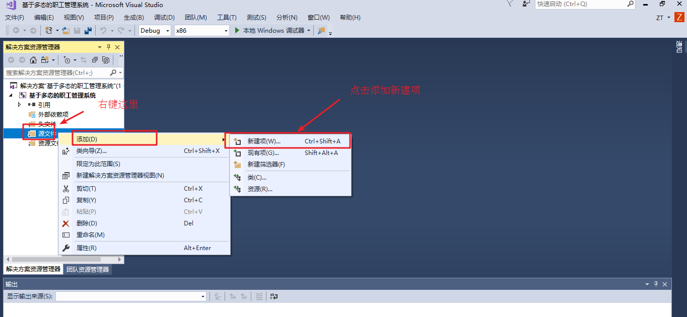

# 职工管理系统

---

## 管理系统需求

职工管理系统可以用来管理公司内所有员工的信息

本教程主要利用 C++ 来实现一个基于多态的职工管理系统

公司中职工分为三类：普通员工、经理、老板，显示信息时，需要显示职工编号、职工姓名、职工岗位、以及职责

* 普通员工职责：完成经理交给的任务
* 经理职责：完成老板交给的任务，并下发任务给员工
* 老板职责：管理公司所有事务

管理系统中需要实现的功能如下：

* 退出管理程序：退出当前管理系统
* 增加职工信息：实现批量添加职工功能，将信息录入到文件中，职工信息为：职工编号、姓名、部门编号
* 显示职工信息：显示公司内部所有职工的信息
* 删除离职职工：按照编号删除指定的职工
* 修改职工信息：按照编号修改职工个人信息
* 查找职工信息：按照职工的编号或者职工的姓名进行查找相关的人员信息
* 按照编号排序：按照职工编号，进行排序，排序规则由用户指定
* 清空所有文档：清空文件中记录的所有职工信息(清空前需要再次确认，防止误删)

系统界面效果如下：

```shell
********************************************
*********  欢迎使用职工管理系统！ **********
*************  0.退出管理程序  *************
*************  1.增加职工信息  *************
*************  2.显示职工信息  *************
*************  3.删除离职职工  *************
*************  4.修改职工信息  *************
*************  5.查找职工信息  *************
*************  6.按照编号排序  *************
*************  7.清空所有文档  *************
********************************************

请输入您的选择:

```

需根据用户不同的选择，完成不同的功能

---

## 创建项目

创建项目步骤如下：

* 创建新项目
* 添加文件

### 创建项目

打开 vs 2022 后，点击创建新项目，创建新的 C++ 项目


填写项目名称以及项目路径，点击确定


### 添加文件

右键源文件，进行添加文件操作




至此，项目已创建完毕

---

## 创建管理类

​管理类负责的内容如下：

* 与用户的沟通菜单界面
* 对职工增删改查的操作
* 与文件的读写交互

### 创建文件 

在头文件和源文件的文件夹下分别创建 `workerManager.h` 和 `workerManager.cpp` 文件


### 头文件实现

在 `workerManager.h` 中设计管理类

code：

```cpp
#pragma once
#include <iostream>

using namespace std;

class WorkerManager
{
public:
    // 构造函数
    WorkerManager();

    // 析构函数
    ~WorkerManager();
};
```

### 源文件实现

在 `workerManager.cpp` 中将构造和析构函数空实现补全

code:

```cpp
#include "workerManager.h"

// 构造函数
WorkerManager::WorkerManager()
{
}

// 析构函数
WorkerManager::~WorkerManager()
{
}
```

至此职工管理类以创建完毕

---

## 菜单功能

**功能描述**：

与用户的沟通界面

### 添加成员函数

在管理类 `workerManager.h` 中添加成员函数 `void showMenu();`

### 菜单功能实现

在管理类 `workerManager.cpp` 中实现 `showMenu()` 函数

```cpp
// 展示菜单
void WorkerManager::showMenu()
{
    cout << "********************************************" << endl;
    cout << "*********  欢迎使用职工管理系统！ **********" << endl;
    cout << "*************  0.退出管理程序  *************" << endl;
    cout << "*************  1.增加职工信息  *************" << endl;
    cout << "*************  2.显示职工信息  *************" << endl;
    cout << "*************  3.删除离职职工  *************" << endl;
    cout << "*************  4.修改职工信息  *************" << endl;
    cout << "*************  5.查找职工信息  *************" << endl;
    cout << "*************  6.按照编号排序  *************" << endl;
    cout << "*************  7.清空所有文档  *************" << endl;
    cout << "********************************************" << endl;
    cout << endl;
}
```

### 测试菜单功能

在职工管理系统 `.cpp` 中测试菜单功能

```cpp
#include <iostream>
#include "workerManager.h"

using namespace std;

int main()
{
    WorkerManager wm;
    wm.showMenu();

    /*
        *******************************************
        *********  欢迎使用职工管理系统！ ***********
        *************  0.退出管理程序  *************
        *************  1.增加职工信息  *************
        *************  2.显示职工信息  *************
        *************  3.删除离职职工  *************
        *************  4.修改职工信息  *************
        *************  5.查找职工信息  *************
        *************  6.按照编号排序  *************
        *************  7.清空所有文档  *************
        *******************************************

     */

    return 0;
}
```

---

## 退出功能

### 提供功能接口

写一个函数，提供分支选择，提供每个功能接口

```cpp
void start()
{
    WorkerManager wm;
    int choice = 1;
    while (true)
    {
        // 展示菜单
        wm.showMenu();
        cout << "请输入您的选择:" << endl;
        cin >> choice;

        switch (choice)
        {
        case 0:
            // 退出系统
            break;
        case 1:
            // 添加职工
            break;
        case 2:
            // 显示职工
            break;
        case 3:
            // 删除职工
            break;
        case 4:
            // 修改职工
            break;
        case 5:
            // 查找职工
            break;
        case 6:
            // 排序职工
            break;
        case 7:
            // 清空文件
            break;
        default:
            system("clear");
            break;
        }
    }
}
```

### 实现退出功能

在 `workerManager.h` 中提供退出系统的成员函数 `void exitSystem();`

在 `workerManager.cpp` 中提供具体的功能实现

```cpp
// 退出系统
void WorkerManager::exitSystem()
{
    cout << "欢迎下次使用" << endl;
    exit(0);
}
```

### 测试功能

在 `start()` 函数分支 0 选项中，调用退出程序的接口

```cpp
case 0:
    // 退出系统
    wm.exitSystem();
    break;
```

运行测试效果如下:

```shell
********************************************
*********  欢迎使用职工管理系统！ **********
*************  0.退出管理程序  *************
*************  1.增加职工信息  *************
*************  2.显示职工信息  *************
*************  3.删除离职职工  *************
*************  4.修改职工信息  *************
*************  5.查找职工信息  *************
*************  6.按照编号排序  *************
*************  7.清空所有文档  *************
********************************************

请输入您的选择:
0
欢迎下次使用
```

---

## 创建职工类

### 创建职工抽象类

职工的分类为：普通员工、经理、老板

将三种职工抽象到一个类(worker)中，利用多态管理不同职工种类

职工的属性为：职工编号、职工姓名、职工所在部门编号

职工的行为为：岗位职责信息描述，获取岗位名称

头文件文件夹下创建文件 `worker.h` 文件并且添加如下代码：

```cpp
#pragma once
#include <iostream>

using namespace std;

// Worker 抽象类
class Worker
{
public:
    // 职工编号
    int mId;
    // 职工姓名
    string name;
    // 职工所在部门名称编号
    int deptId;

public:
    // 显示个人信息
    virtual void showInfo() = 0;

    // 获取岗位名称
    virtual string getDeptName() = 0;
};
```

### 创建普通员工类

普通员工类 **继承** 职工抽象类，并重写父类中纯虚函数

在头文件和源文件的文件夹下分别创建 `employee.h` 和 `employee.cpp` 文件

`employee.h` 中代码如下: 

```cpp
#pragma once
#include <iostream>
#include "worker.h"

using namespace std;

// 员工类

class Employee : public Worker
{
public:
    // 构造函数
    Employee(int mId, string name, int dId);

    // 显示个人信息
    virtual void showInfo();

    // 获取岗位名称
    virtual string getDeptName();
};
```

`employee.cpp` 中代码如下: 

```cpp
#include "employee.h"

// 构造函数
Employee::Employee(int mId, string name, int dId)
{
    this->mId = mId;
    this->name = name;
    this->deptId = dId;
}

// 显示个人信息
void Employee::showInfo()
{
    cout << "职工编号: " << this->mId
         << " \t职工姓名: " << this->name
         << " \t岗位: " << this->getDeptName()
         << " \t岗位职责: 完成经理交给的任务" << endl;
}

// 获取岗位名称
string Employee::getDeptName()
{
    return string("员工");
}
```

### 创建经理类

经理类 **继承** 职工抽象类，并重写父类中纯虚函数，和普通员工类似

在头文件和源文件的文件夹下分别创建 `manager.h` 和 `manager.cpp` 文件

`manager.h` 中代码如下：

```cpp
#pragma once
#include <iostream>
#include "worker.h"

using namespace std;

class Manager : public Worker
{
public:
    // 构造函数
    Manager(int mId, string name, int dId);

    // 显示个人信息
    virtual void showInfo();

    // 获取岗位名称
    virtual string getDeptName();
};
```

`manager.cpp` 中代码如下：

```cpp
#include "manager.h"

// 构造函数
Manager::Manager(int mId, string name, int dId)
{
    this->mId = mId;
    this->name = name;
    this->deptId = dId;
}

// 显示个人信息
void Manager::showInfo()
{
    cout << "职工编号: " << this->mId
         << " \t职工姓名: " << this->name
         << " \t岗位: " << this->getDeptName()
         << " \t岗位职责：完成老板交给的任务，并下发任务给员工" << endl;
}

// 获取岗位名称
string Manager::getDeptName()
{
    return string("经理");
}
```

### 创建老板类

老板类 **继承** 职工抽象类，并重写父类中纯虚函数，和普通员工类似

在头文件和源文件的文件夹下分别创建 `boss.h` 和 `boss.cpp` 文件

`boss.h` 中代码如下：

```cpp
#pragma once
#include <iostream>
#include "worker.h"

using namespace std;

class Boss : public Worker
{
public:
    // 构造函数
    Boss(int mId, string name, int dId);

    // 显示个人信息
    virtual void showInfo();

    // 获取岗位名称
    virtual string getDeptName();
};
```

`boss.cpp` 中代码如下:

```cpp
#include "boss.h"

// 构造函数
Boss::Boss(int mId, string name, int dId)
{
    this->mId = mId;
    this->name = name;
    this->deptId = dId;
}

// 显示个人信息
void Boss::showInfo()
{
    cout << "职工编号: " << this->mId
         << " \t职工姓名: " << this->name
         << " \t岗位: " << this->getDeptName()
         << " \t岗位职责：管理公司所有事务" << endl;
}

// 获取岗位名称
string Boss::getDeptName()
{
    return string("总裁");
}
```

继承父类抽象类的子类中的纯虚函数在声明时，`virtual` 可删可不删

### 测试多态

在 `main.cpp` 中添加测试函数，并且运行能够产生多态

测试代码如下：

```cpp
void test()
{
    Worker *worker = NULL;

    worker = new Employee(1, "张三", 1);
    worker->showInfo();
    delete worker;

    worker = new Manager(2, "李四", 2);
    worker->showInfo();
    delete worker;

    worker = new Boss(3, "王五", 3);
    worker->showInfo();
    delete worker;
}
```

运行效果如下:

```shell
职工编号: 1     职工姓名: 张三  岗位: 员工      岗位职责: 完成经理交给的任务
职工编号: 2     职工姓名: 李四  岗位: 经理      岗位职责：完成老板交给的任务，并下发任务给员工
职工编号: 3     职工姓名: 王五  岗位: 总裁      岗位职责：管理公司所有事务
```

测试成功后，测试代码可以注释保留，或者选择删除

---

## 添加职工

**功能描述**：

批量添加职工，并且保存到文件中

### 功能分析

**分析**：

用户在批量创建时，可能会创建不同种类的职工

如果想将所有不同种类的员工都放入到一个数组中，可以将所有员工的指针维护到一个数组里

如果想在程序中维护这个不定长度的数组，可以将数组创建到堆区，并利用 `Worker **` 的指针维护


### 功能实现

在 `WokerManager.h` 头文件中添加成员属性 

```cpp
// 记录文件中的人数个数
int num;
// 员工数组的指针
Worker **workerArray;
```

在 `WorkerManager` 构造函数中初始化属性

```cpp
// 构造函数
WorkerManager::WorkerManager()
{   
	// 初始化人数
	this->num = 0;
	// 初始化数组指针
	this->workerArray = NULL;
}
```

在 `workerManager.h` 中添加成员函数

```cpp
// 增加职工
void addWorker();
```

`workerManager.cpp` 中实现该函数

```cpp
// 增加职工
void WorkerManager::addWorker()
{
    cout << "请输入增加职工数量： " << endl;

    int num = 0;
    cin >> num;

    if (num > 0)
    {
        // 计算新开辟的内存空间大小
        int size = this->num + num;
        // 开辟新的空间
        Worker **newSpace = new Worker *[size];

        // 将原空间下内容存放到新空间下
        if (this->workerArray != NULL)
        {
            for (int i = 0; i < this->num; i++)
            {
                newSpace[i] = this->workerArray[i];
            }
        }

        // 输入新的数据
        for (int i = 0; i < num; i++)
        {
            int id;
            string name;
            int dSelect;

            cout << "请输入第 " << i + 1 << " 个新职工编号：" << endl;
            cin >> id;

            cout << "请输入第 " << i + 1 << " 个新职工姓名：" << endl;
            cin >> name;

            cout << "请选择该职工的岗位：" << endl;
            cout << "1、普通职工" << endl;
            cout << "2、经理" << endl;
            cout << "3、老板" << endl;
            cin >> dSelect;

            Worker *worker = NULL;
            switch (dSelect)
            {
            case 1:
            {
                // 普通员工
                worker = new Employee(id, name, 1);
                break;
            }
            case 2:
            {
                // 经理
                worker = new Manager(id, name, 2);
                break;
            }
            case 3:
            {
                // 老板
                worker = new Boss(id, name, 3);
                break;
            }
            default:
            {
                break;
            }
            }
            newSpace[this->num + i] = worker;
        }

        // 释放原有空间
        delete[] this->workerArray;
        // 更改指针指向
        this->workerArray = newSpace;
        // 更新个数
        this->num = size;
        // 提示信息
        cout << "成功添加" << num << "名新职工！" << endl;
    }
    else
    {
        cout << "输入有误" << endl;
    }
}
```

在 `WorkerManager.cpp` 的析构函数中，释放堆区数据

```cpp
// 析构函数
WorkerManager::~WorkerManager()
{
    if (this->workerArray != NULL)
    {
        delete[] this->workerArray;
    }
}
```

### 测试添加

在 `main` 函数分支 1 选项中，调用添加职工接口

```cpp
case 1:
    // 添加职工
    wm.addWorker();
    break;
```

效果如下：

```shell
********************************************
*********  欢迎使用职工管理系统！ **********
*************  0.退出管理程序  *************
*************  1.增加职工信息  *************
*************  2.显示职工信息  *************
*************  3.删除离职职工  *************
*************  4.修改职工信息  *************
*************  5.查找职工信息  *************
*************  6.按照编号排序  *************
*************  7.清空所有文档  *************
********************************************

请输入您的选择:
1
请输入增加职工数量： 
1
请输入第 1 个新职工编号：
001
请输入第 1 个新职工姓名：
Mark
请选择该职工的岗位：
1、普通职工
2、经理
3、老板
1
成功添加1名新职工！
...
```

至此，添加职工到程序中功能实现完毕

---

## 文件交互 - 写文件

**功能描述**：

**对文件进行读写**

​在上一个添加功能中，我们只是将所有的数据添加到了内存中，一旦程序结束就无法保存了

​因此文件管理类中需要一个与文件进行交互的功能，对于文件进行读写操作

### 设定文件路径

首先我们将文件路径，在 `workerManager.h` 中添加宏常量，并且包含头文件 `fstream`

```cpp
#include <fstream>
#define FILENAME "empFile.txt"
```

### 成员函数声明

在 `workerManager.h` 中类里添加成员函数 `void save()`

```cpp
// 保存文件
void save();
```

### 保存文件功能实现

```cpp
// 保存文件
void WorkerManager::save()
{
    ofstream ofs;
    ofs.open(FILENAME, ios::out);

    for (int i = 0; i < this->num; i++)
    {
        ofs << this->workerArray[i]->mId << " "
            << this->workerArray[i]->name << " "
            << this->workerArray[i]->deptId << endl;
    }

    ofs.close();
}
```

### 保存文件功能测试

在添加职工功能 `addWorker()` 中添加成功后添加保存文件函数

```cpp
// 保存到文件中
this->save();
```

再次运行代码，添加职工

```shell
********************************************
*********  欢迎使用职工管理系统！ **********
*************  0.退出管理程序  *************
*************  1.增加职工信息  *************
*************  2.显示职工信息  *************
*************  3.删除离职职工  *************
*************  4.修改职工信息  *************
*************  5.查找职工信息  *************
*************  6.按照编号排序  *************
*************  7.清空所有文档  *************
********************************************

请输入您的选择:
1
请输入增加职工数量： 
1
请输入第 1 个新职工编号：
001
请输入第 1 个新职工姓名：
Jack
请选择该职工的岗位：
1、普通职工
2、经理
3、老板
1
成功添加1名新职工！
```

同级目录下多出文件，并且保存了添加的信息


---

## 文件交互 - 读文件

**功能描述**：

将文件中的内容读取到程序中

虽然我们实现了添加职工后保存到文件的操作，但是每次开始运行程序，并没有将文件中数据读取到程序中

而我们的程序功能中还有清空文件的需求

因此构造函数初始化数据的情况分为三种

* 第一次使用，文件未创建
* 文件存在，但是数据被用户清空
* 文件存在，并且保存职工的所有数据

### 文件未创建

在 `workerManager.h` 中添加新的成员属性 `fileIsEmpty` 标志文件是否为空

```cpp
// 标志文件是否为空
bool fileIsEmpty;
```

修改 `WorkerManager.cpp` 中构造函数代码

```cpp
// 构造函数
WorkerManager::WorkerManager()
{
    ifstream ifs;
    ifs.open(FILENAME, ios::in);

    // 文件不存在
    if (!ifs.is_open())
    {
        // 测试输出
        cout << "文件不存在" << endl;
        // 初始化人数
        this->num = 0;
        // 初始化数组指针
        this->workerArray = NULL;
        // 初始化文件为空标志
        this->fileIsEmpty = true;
        // 关闭文件
        ifs.close();
        return;
    }
}
```

删除文件后，测试文件不存在时初始化数据功能

```shell
文件不存在
********************************************
*********  欢迎使用职工管理系统！ **********
*************  0.退出管理程序  *************
*************  1.增加职工信息  *************
*************  2.显示职工信息  *************
*************  3.删除离职职工  *************
*************  4.修改职工信息  *************
*************  5.查找职工信息  *************
*************  6.按照编号排序  *************
*************  7.清空所有文档  *************
********************************************

请输入您的选择:
1
请输入增加职工数量： 
1
请输入第 1 个新职工编号：
100
请输入第 1 个新职工姓名：
Marl
请选择该职工的岗位：
1、普通职工
2、经理
3、老板
1
成功添加1名新职工！
```

同级目录下也多出文件，并且保存了添加的信息

### 文件存在且数据为空

在 `workerManager.cpp` 中的构造函数追加代码：

```cpp
// 文件存在，并且没有记录
char ch;
ifs >> ch;
if (ifs.eof())
{
    cout << "文件为空!" << endl;
    // 初始化人数
    this->num = 0;
    // 初始化数组指针
    this->workerArray = NULL;
    // 初始化文件为空标志
    this->fileIsEmpty = true;
    // 关闭文件
    ifs.close();
    return;
}
```

将文件创建后清空文件内容，并测试该情况下初始化功能

```shell
文件为空!
********************************************
*********  欢迎使用职工管理系统！ **********
*************  0.退出管理程序  *************
*************  1.增加职工信息  *************
*************  2.显示职工信息  *************
*************  3.删除离职职工  *************
*************  4.修改职工信息  *************
*************  5.查找职工信息  *************
*************  6.按照编号排序  *************
*************  7.清空所有文档  *************
********************************************

请输入您的选择:
1
请输入增加职工数量： 
1
请输入第 1 个新职工编号：
1001
请输入第 1 个新职工姓名：
Jack
请选择该职工的岗位：
1、普通职工
2、经理
3、老板
1
成功添加1名新职工！
```

我们发现文件不存在或者为空清空 `fileIsEmpty` 判断文件是否为空的标志都为真，那何时为假？

成功添加职工后，应该更改文件不为空的标志

在 `void WorkerManager::addWorker()` 成员函数中添加：

```cpp
this->num = size;
// 更新职工不为空标志
this->fileIsEmpty = false;
// 提示信息
```

### 文件存在且保存职工数据

#### 获取记录的职工人数

在 `workerManager.h` 中添加成员函数 `int getWorkerNum();`

```cpp
// 统计人数
int getWorkerNum();
```

`workerManager.cpp` 中实现

```cpp
// 统计人数
int WorkerManager::getWorkerNum()
{
    ifstream ifs;
    ifs.open(FILENAME, ios::in);
    int num = 0;

    int id;
    string name;
    int dId;

    while (ifs >> id && ifs >> name && ifs >> dId)
    {
        // 纪录人数
        num++;
    }
    ifs.close();
    return num;
}
```

在 `workerManager.cpp` 构造函数中继续追加代码：

```cpp
int num = this->getWorkerNum();
cout << "职工个数为：" << num << endl; // 测试代码
// 更新成员属性
this->num = num;
```

手动添加往 `empFile.txt` 一些职工数据，测试获取职工数量函数

```text
1001 Jack 1
1002 Mark 2
1003 Cury 3

```

```shell
职工个数为：3
********************************************
*********  欢迎使用职工管理系统！ **********
*************  0.退出管理程序  *************
*************  1.增加职工信息  *************
*************  2.显示职工信息  *************
*************  3.删除离职职工  *************
*************  4.修改职工信息  *************
*************  5.查找职工信息  *************
*************  6.按照编号排序  *************
*************  7.清空所有文档  *************
********************************************

请输入您的选择:

```

#### 初始化数组

根据职工的数据以及职工数据，初始化 `workerManager` 中的 `Worker **workerArray` 指针

在 `WorkerManager.h` 中添加成员函数 `void initWorker();`

```cpp
// 初始化员工
void initWorker();
```

在 `WorkerManager.cpp` 中实现

```cpp
// 初始化员工
void WorkerManager::initWorker()
{
    ifstream ifs;
    ifs.open(FILENAME, ios::in);

    int id;
    string name;
    int dId;

    int idx = 0;
    while (ifs >> id && ifs >> name && ifs >> dId)
    {
        Worker *worker = NULL;
        // 根据不同的部门 id 创建不同对象
        if (dId == 1)
        {
            // 1 普通员工
            worker = new Employee(id, name, dId);
        }
        else if (dId == 2)
        {
            // 2 经理
            worker = new Manager(id, name, dId);
        }
        else
        {
            // 3 总裁
            worker = new Boss(id, name, dId);
        }
        // 存放在数组中
        this->workerArray[idx] = worker;
        idx++;
    }
    
    // 关闭文件
    ifs.close();
}
```

在 `workerManager.cpp` 构造函数中追加代码

```cpp
// 根据职工数创建数组
this->workerArray = new Worker *[this->num];
// 初始化职工
this->initWorker();
// 文件不为空且存在数据
this->fileIsEmpty = false;

// 测试代码
for (int i = 0; i < this->num; i++)
{
    cout << "职工号： " << this->workerArray[i]->mId
        << " 职工姓名： " << this->workerArray[i]->name
        << " 部门编号： " << this->workerArray[i]->deptId << endl;
}

// 关闭文件
ifs.close();
```

运行程序，测试从文件中获取的数据

```shell
职工个数为：3
职工号： 1001 职工姓名： Jack 部门编号： 1
职工号： 1002 职工姓名： Mark 部门编号： 2
职工号： 1003 职工姓名： Cury 部门编号： 3
********************************************
*********  欢迎使用职工管理系统！ **********
*************  0.退出管理程序  *************
*************  1.增加职工信息  *************
*************  2.显示职工信息  *************
*************  3.删除离职职工  *************
*************  4.修改职工信息  *************
*************  5.查找职工信息  *************
*************  6.按照编号排序  *************
*************  7.清空所有文档  *************
********************************************

请输入您的选择:

```

至此初始化数据功能完毕，测试代码可以注释或删除掉

---

## 显示职工

**功能描述**：

显示当前所有职工信息

### 显示职工函数声明

在 `workerManager.h` 中添加成员函数 `void showWorker();`

```cpp
// 显示职工
void showWorker();
```

### 显示职工函数实现

在 `workerManager.cpp` 中实现成员函数 `void showWorker();`

```cpp
// 显示职工
void WorkerManager::showWorker()
{
    if (this->fileIsEmpty)
    {
        cout << "文件不存在或记录为空！" << endl;
    }
    else
    {
        for (int i = 0; i < num; i++)
        {
            // 利用多态调用接口
            this->workerArray[i]->showInfo();
        }
    }
}
```

### 测试显示职工

在 `main` 函数分支 2 选项中，调用显示职工接口

```cpp
case 2:
    // 显示职工
    wm.showWorker();
    break;
```

测试时分别测试文件为空和文件不为空两种情况

测试效果：

测试文件不存在或者为空情况

```shell
********************************************
*********  欢迎使用职工管理系统！ **********
*************  0.退出管理程序  *************
*************  1.增加职工信息  *************
*************  2.显示职工信息  *************
*************  3.删除离职职工  *************
*************  4.修改职工信息  *************
*************  5.查找职工信息  *************
*************  6.按照编号排序  *************
*************  7.清空所有文档  *************
********************************************

请输入您的选择:
2
文件不存在或记录为空！
```

测试文件存在且有记录情况

```sh
********************************************
*********  欢迎使用职工管理系统！ **********
*************  0.退出管理程序  *************
*************  1.增加职工信息  *************
*************  2.显示职工信息  *************
*************  3.删除离职职工  *************
*************  4.修改职工信息  *************
*************  5.查找职工信息  *************
*************  6.按照编号排序  *************
*************  7.清空所有文档  *************
********************************************

请输入您的选择:
1
请输入增加职工数量： 
2
请输入第 1 个新职工编号：
101
请输入第 1 个新职工姓名：
Jack
请选择该职工的岗位：
1、普通职工
2、经理
3、老板
1
请输入第 2 个新职工编号：
102
请输入第 2 个新职工姓名：
Mark
请选择该职工的岗位：
1、普通职工
2、经理
3、老板
2
成功添加2名新职工！
********************************************
*********  欢迎使用职工管理系统！ **********
*************  0.退出管理程序  *************
*************  1.增加职工信息  *************
*************  2.显示职工信息  *************
*************  3.删除离职职工  *************
*************  4.修改职工信息  *************
*************  5.查找职工信息  *************
*************  6.按照编号排序  *************
*************  7.清空所有文档  *************
********************************************

请输入您的选择:
2
职工编号: 101   职工姓名: Jack  岗位: 员工      岗位职责: 完成经理交给的任务
职工编号: 102   职工姓名: Mark  岗位: 经理      岗位职责：完成老板交给的任务，并下发任务给员工
```

```shell
********************************************
*********  欢迎使用职工管理系统！ **********
*************  0.退出管理程序  *************
*************  1.增加职工信息  *************
*************  2.显示职工信息  *************
*************  3.删除离职职工  *************
*************  4.修改职工信息  *************
*************  5.查找职工信息  *************
*************  6.按照编号排序  *************
*************  7.清空所有文档  *************
********************************************

请输入您的选择:
2
职工编号: 101   职工姓名: Jack  岗位: 员工      岗位职责: 完成经理交给的任务
职工编号: 102   职工姓名: Mark  岗位: 经理      岗位职责：完成老板交给的任务，并下发任务给员工
```

测试完毕，至此，显示所有职工信息功能实现

---

## 删除职工

**功能描述**：

按照职工的编号进行删除职工操作

### 删除职工函数声明

在 `workerManager.h` 中添加成员函数 `void deleteWorker();`

```cpp
// 删除职工
void deleteWorker();
```

### 职工是否存在函数声明

很多功能都需要用到根据职工是否存在来进行操作如：

删除职工、修改职工、查找职工

因此添加该公告函数，以便后续调用

在 `workerManager.h` 中添加成员函数 `int isExist(int id);`

```cpp
// 按照职工编号判断职工是否存在，若存在返回职工在数组中位置，不存在返回 -1
int isExist(int id);
```

### 职工是否存在函数实现

在 `workerManager.cpp` 中实现成员函数 `int isExist(int id);`

```cpp
// 按照职工编号判断职工是否存在，若存在返回职工在数组中位置，不存在返回 -1
int WorkerManager::isExist(int id)
{
    int idx = -1;
    for (int i = 0; i < this->num; i++)
    {
        if (this->workerArray[i]->mId == id)
        {
            idx = i;
            break;
        }
    }
    return idx;
}
```

### 删除职工函数实现

在 `workerManager.cpp` 中实现成员函数 `void deleteWorker();`

```cpp
// 删除职工
void WorkerManager::deleteWorker()
{
    if (this->fileIsEmpty)
    {
        cout << "文件不存在或记录为空！" << endl;
    }
    else
    {
        // 按职工编号删除
        cout << "请输入想要删除的职工号：" << endl;
        int id = 0;
        cin >> id;

        int index = this->isExist(id);
        if (index != -1)
        {
            for (int i = index; i < this->num; i++)
            {
                this->workerArray[i] = this->workerArray[i + 1];
            }
            this->num--;

            // 同步数据到文件中
            this->save();
            cout << "删除成功！" << endl;
        }
        else
        {
            cout << "删除失败，未找到该职工" << endl;
        }
    }
}
```

### 测试删除职工

在 `main` 函数分支 3 选项中，调用删除职工接口

```cpp
case 3:
    // 删除职工
    wm.deleteWorker();
    break;
```

测试 1 - 删除不存在职工情况

```shell
********************************************
*********  欢迎使用职工管理系统！ **********
*************  0.退出管理程序  *************
*************  1.增加职工信息  *************
*************  2.显示职工信息  *************
*************  3.删除离职职工  *************
*************  4.修改职工信息  *************
*************  5.查找职工信息  *************
*************  6.按照编号排序  *************
*************  7.清空所有文档  *************
********************************************

请输入您的选择:
3
请输入想要删除的职工号：
1000
删除失败，未找到该职工
```

测试 2 - 删除存在的职工情况

```shell
********************************************
*********  欢迎使用职工管理系统！ **********
*************  0.退出管理程序  *************
*************  1.增加职工信息  *************
*************  2.显示职工信息  *************
*************  3.删除离职职工  *************
*************  4.修改职工信息  *************
*************  5.查找职工信息  *************
*************  6.按照编号排序  *************
*************  7.清空所有文档  *************
********************************************

请输入您的选择:
3
请输入想要删除的职工号：
1002
删除成功！
```

再次显示所有职工信息，确保已经删除

```shell
********************************************
*********  欢迎使用职工管理系统！ **********
*************  0.退出管理程序  *************
*************  1.增加职工信息  *************
*************  2.显示职工信息  *************
*************  3.删除离职职工  *************
*************  4.修改职工信息  *************
*************  5.查找职工信息  *************
*************  6.按照编号排序  *************
*************  7.清空所有文档  *************
********************************************

请输入您的选择:
2
职工编号: 1001  职工姓名: Kara  岗位: 员工      岗位职责: 完成经理交给的任务
职工编号: 1003  职工姓名: Mark  岗位: 总裁      岗位职责：管理公司所有事务
```

查看文件中信息，再次核实员工已被完全删除

```shell
1001 Kara 1
1003 Mark 3

```

至此，删除职工功能实现完毕

---

## 修改职工

**功能描述**：

能够按照职工的编号对职工信息进行修改并保存

### 修改职工函数声明

在 `workerManager.h` 中添加成员函数 `void modWorker();`

```cpp
// 修改职工
void modWorker();
```

### 修改职工函数实现

在 `workerManager.cpp` 中实现成员函数 `void modWorker();`

```cpp
// 修改职工
void WorkerManager::modWorker()
{
    if (this->fileIsEmpty)
    {
        cout << "文件不存在或记录为空！" << endl;
    }
    else
    {
        cout << "请输入修改职工的编号：" << endl;

        int id;
        cin >> id;

        int ret = this->isExist(id);
        if (ret != -1)
        {
            // 查找到编号的职工
            delete this->workerArray[ret];

            int newId = 0;
            string newName = "";
            int dSelect = 0;

            cout << "查到： " << id << "号职工，请输入新职工号： " << endl;
            cin >> newId;

            cout << "请输入新姓名： " << endl;
            cin >> newName;

            cout << "请输入岗位： " << endl;
            cout << "1、普通职工" << endl;
            cout << "2、经理" << endl;
            cout << "3、老板" << endl;
            cin >> dSelect;

            Worker *worker = NULL;
            switch (dSelect)
            {
            case 1:
                worker = new Employee(newId, newName, dSelect);
                break;
            case 2:
                worker = new Manager(newId, newName, dSelect);
                break;
            case 3:
                worker = new Boss(newId, newName, dSelect);
                break;
            default:
                break;
            }

            // 更改数据到数组中
            this->workerArray[ret] = worker;
            cout << "修改成功！" << endl;

            // 保存到文件中
            this->save();
        }
        else
        {
            cout << "修改失败，查无此人" << endl;
        }
    }
}
```

### 测试修改职工

在 `main` 函数分支 4 选项中，调用修改职工接口

```cpp
case 4:
    // 修改职工
    wm.modWorker();
    break;
```

测试 1 - 修改不存在职工情况

```shell
********************************************
*********  欢迎使用职工管理系统！ **********
*************  0.退出管理程序  *************
*************  1.增加职工信息  *************
*************  2.显示职工信息  *************
*************  3.删除离职职工  *************
*************  4.修改职工信息  *************
*************  5.查找职工信息  *************
*************  6.按照编号排序  *************
*************  7.清空所有文档  *************
********************************************

请输入您的选择:
4
请输入修改职工的编号：
1005
修改失败，查无此人
```

测试 2 - 修改存在职工情况

```shell
********************************************
*********  欢迎使用职工管理系统！ **********
*************  0.退出管理程序  *************
*************  1.增加职工信息  *************
*************  2.显示职工信息  *************
*************  3.删除离职职工  *************
*************  4.修改职工信息  *************
*************  5.查找职工信息  *************
*************  6.按照编号排序  *************
*************  7.清空所有文档  *************
********************************************

请输入您的选择:
4
请输入修改职工的编号：
1001
查到： 1001号职工，请输入新职工号： 
1001
请输入新姓名： 
Mark
请输入岗位： 
1、普通职工
2、经理
3、老板
2
修改成功！
```

修改后再次查看所有职工信息，并确认修改成功

```shell
********************************************
*********  欢迎使用职工管理系统！ **********
*************  0.退出管理程序  *************
*************  1.增加职工信息  *************
*************  2.显示职工信息  *************
*************  3.删除离职职工  *************
*************  4.修改职工信息  *************
*************  5.查找职工信息  *************
*************  6.按照编号排序  *************
*************  7.清空所有文档  *************
********************************************

请输入您的选择:
2
职工编号: 1000  职工姓名: Jack  岗位: 员工      岗位职责: 完成经理交给的任务
职工编号: 1001  职工姓名: Mark  岗位: 经理      岗位职责：完成老板交给的任务，并下发任务给员工
职工编号: 1002  职工姓名: Cory  岗位: 经理      岗位职责：完成老板交给的任务，并下发任务给员工
职工编号: 1004  职工姓名: Kara  岗位: 总裁      岗位职责：管理公司所有事务
```

再次确认文件中信息也同步更新

```shell
1000 Jack 1
1001 Mark 2
1002 Cory 2
1004 Kara 3

```

至此，修改职工功能已实现

---

## 查找职工

**功能描述**：

提供两种查找职工方式，一种按照职工编号，一种按照职工姓名

### 查找职工函数声明

在 `workerManager.h` 中添加成员函数 `void findWorker();`

```cpp
// 查找职工
void findWorker();
```

### 查找职工函数实现

在 `workerManager.cpp` 中实现成员函数 `void findWorker();`

```cpp
// 查找职工
void WorkerManager::findWorker()
{
    if (this->fileIsEmpty)
    {
        cout << "文件不存在或记录为空！" << endl;
    }
    else
    {
        cout << "请输入查找的方式：" << endl;
        cout << "1、按职工编号查找" << endl;
        cout << "2、按姓名查找" << endl;

        int select = 0;
        cin >> select;

        // 按职工号查找
        if (select == 1)
        {
            int id;
            cout << "请输入查找的职工编号：" << endl;
            cin >> id;

            int ret = this->isExist(id);
            if (ret != -1)
            {
                cout << "查找成功！该职工信息如下：" << endl;
                this->workerArray[ret]->showInfo();
            }
            else
            {
                cout << "查找失败，查无此人" << endl;
            }
        }
        // 按姓名查找
        else if (select == 2)
        {
            string name;
            cout << "请输入查找的姓名：" << endl;
            cin >> name;

            // 查找到的标志
            bool flag = false;
            for (int i = 0; i < this->num; i++)
            {
                if (this->workerArray[i]->name == name)
                {
                    cout << "查找成功,职工编号为："
                         << this->workerArray[i]->mId
                         << " 号的信息如下：" << endl;
                    flag = true;
                    this->workerArray[i]->showInfo();
                }
            }
            if (flag == false)
            {
                // 查无此人
                cout << "查找失败，查无此人" << endl;
            }
        }
        else
        {
            cout << "输入选项有误" << endl;
        }
    }
}
```

### 测试查找职工

在 `main` 函数分支 5 选项中，调用查找职工接口

```shell
case 5:
    // 查找职工
    wm.findWorker();
    break;
```

测试 1 - 按照职工编号查找 - 查找不存在职工

```shell
********************************************
*********  欢迎使用职工管理系统！ **********
*************  0.退出管理程序  *************
*************  1.增加职工信息  *************
*************  2.显示职工信息  *************
*************  3.删除离职职工  *************
*************  4.修改职工信息  *************
*************  5.查找职工信息  *************
*************  6.按照编号排序  *************
*************  7.清空所有文档  *************
********************************************

请输入您的选择:
5
请输入查找的方式：
1、按职工编号查找
2、按姓名查找
1
请输入查找的职工编号：
1005
查找失败，查无此人
```

测试 2 - 按照职工编号查找 - 查找存在职工

```shell
********************************************
*********  欢迎使用职工管理系统！ **********
*************  0.退出管理程序  *************
*************  1.增加职工信息  *************
*************  2.显示职工信息  *************
*************  3.删除离职职工  *************
*************  4.修改职工信息  *************
*************  5.查找职工信息  *************
*************  6.按照编号排序  *************
*************  7.清空所有文档  *************
********************************************

请输入您的选择:
5
请输入查找的方式：
1、按职工编号查找
2、按姓名查找
1
请输入查找的职工编号：
1002
查找成功！该职工信息如下：
职工编号: 1002  职工姓名: Cory  岗位: 经理      岗位职责：完成老板交给的任务，并下发任务给员工
```

测试 3 - 按照职工姓名查找 - 查找不存在职工

```shell
********************************************
*********  欢迎使用职工管理系统！ **********
*************  0.退出管理程序  *************
*************  1.增加职工信息  *************
*************  2.显示职工信息  *************
*************  3.删除离职职工  *************
*************  4.修改职工信息  *************
*************  5.查找职工信息  *************
*************  6.按照编号排序  *************
*************  7.清空所有文档  *************
********************************************

请输入您的选择:
5
请输入查找的方式：
1、按职工编号查找
2、按姓名查找
2
请输入查找的姓名：
Mack
查找失败，查无此人
```

测试 4 - 按照职工姓名查找 - 查找存在职工(如果出现重名，也一并显示，在文件中可以添加重名职工)

```shell
********************************************
*********  欢迎使用职工管理系统！ **********
*************  0.退出管理程序  *************
*************  1.增加职工信息  *************
*************  2.显示职工信息  *************
*************  3.删除离职职工  *************
*************  4.修改职工信息  *************
*************  5.查找职工信息  *************
*************  6.按照编号排序  *************
*************  7.清空所有文档  *************
********************************************

请输入您的选择:
2
职工编号: 1000  职工姓名: Jack  岗位: 员工      岗位职责: 完成经理交给的任务
职工编号: 1001  职工姓名: Mark  岗位: 经理      岗位职责：完成老板交给的任务，并下发任务给员工
职工编号: 1002  职工姓名: Cory  岗位: 经理      岗位职责：完成老板交给的任务，并下发任务给员工
职工编号: 1004  职工姓名: Mark  岗位: 总裁      岗位职责：管理公司所有事务
```

```shell
********************************************
*********  欢迎使用职工管理系统！ **********
*************  0.退出管理程序  *************
*************  1.增加职工信息  *************
*************  2.显示职工信息  *************
*************  3.删除离职职工  *************
*************  4.修改职工信息  *************
*************  5.查找职工信息  *************
*************  6.按照编号排序  *************
*************  7.清空所有文档  *************
********************************************

请输入您的选择:
5
请输入查找的方式：
1、按职工编号查找
2、按姓名查找
2
请输入查找的姓名：
Mark
查找成功,职工编号为：1001 号的信息如下：
职工编号: 1001  职工姓名: Mark  岗位: 经理      岗位职责：完成老板交给的任务，并下发任务给员工
查找成功,职工编号为：1004 号的信息如下：
职工编号: 1004  职工姓名: Mark  岗位: 总裁      岗位职责：管理公司所有事务
```

至此，查找职工功能实现完毕

---

## 排序

**功能描述**：

按照职工编号进行排序，排序的顺序由用户指定

### 排序函数声明

在 `workerManager.h` 中添加成员函数 `void sortWorker();`

```cpp
// 排序职工
void sortWorker();
```

### 排序函数实现

在 `workerManager.cpp` 中实现成员函数 `void sortWorker();`

```cpp
// 排序职工
void WorkerManager::sortWorker()
{
    if (this->fileIsEmpty)
    {
        cout << "文件不存在或记录为空！" << endl;
    }
    else
    {
        cout << "请选择排序方式： " << endl;
        cout << "1、按职工号进行升序" << endl;
        cout << "2、按职工号进行降序" << endl;

        int select = 0;
        cin >> select;

        for (int i = 0; i < this->num; i++)
        {
            int minOrMax = i;
            for (int j = i + 1; j < this->num; j++)
            {
                // 升序
                if (select == 1)
                {
                    if (this->workerArray[minOrMax]->mId > this->workerArray[j]->mId)
                    {
                        minOrMax = j;
                    }
                }
                // 降序
                else
                {
                    if (this->workerArray[minOrMax]->mId < this->workerArray[j]->mId)
                    {
                        minOrMax = j;
                    }
                }
            }

            if (i != minOrMax)
            {
                Worker *temp = this->workerArray[i];
                this->workerArray[i] = this->workerArray[minOrMax];
                this->workerArray[minOrMax] = temp;
            }
        }

        cout << "排序成功,排序后结果为：" << endl;
        this->save();
        this->showWorker();
    }
}
```

### 测试排序功能

在 `main` 函数分支 6 选项中，调用排序职工接口

```cpp
case 6:
    // 排序职工
    wm.sortWorker();
    break;
```

测试：

首先添加一些职工，序号是无序的，例如：

```shell
********************************************
*********  欢迎使用职工管理系统！ **********
*************  0.退出管理程序  *************
*************  1.增加职工信息  *************
*************  2.显示职工信息  *************
*************  3.删除离职职工  *************
*************  4.修改职工信息  *************
*************  5.查找职工信息  *************
*************  6.按照编号排序  *************
*************  7.清空所有文档  *************
********************************************

请输入您的选择:
2
职工编号: 1000  职工姓名: Jack  岗位: 员工      岗位职责: 完成经理交给的任务
职工编号: 1006  职工姓名: Anna  岗位: 员工      岗位职责: 完成经理交给的任务
职工编号: 1004  职工姓名: Mark  岗位: 总裁      岗位职责：管理公司所有事务
职工编号: 1001  职工姓名: Mark  岗位: 经理      岗位职责：完成老板交给的任务，并下发任务给员工
职工编号: 1002  职工姓名: Cory  岗位: 经理      岗位职责：完成老板交给的任务，并下发任务给员工
职工编号: 1005  职工姓名: Mavi  岗位: 员工      岗位职责: 完成经理交给的任务
```

测试 - 升序排序

```shell
********************************************
*********  欢迎使用职工管理系统！ **********
*************  0.退出管理程序  *************
*************  1.增加职工信息  *************
*************  2.显示职工信息  *************
*************  3.删除离职职工  *************
*************  4.修改职工信息  *************
*************  5.查找职工信息  *************
*************  6.按照编号排序  *************
*************  7.清空所有文档  *************
********************************************

请输入您的选择:
6
请选择排序方式： 
1、按职工号进行升序
2、按职工号进行降序
1
排序成功,排序后结果为：
职工编号: 1000  职工姓名: Jack  岗位: 员工      岗位职责: 完成经理交给的任务
职工编号: 1001  职工姓名: Mark  岗位: 经理      岗位职责：完成老板交给的任务，并下发任务给员工
职工编号: 1002  职工姓名: Cory  岗位: 经理      岗位职责：完成老板交给的任务，并下发任务给员工
职工编号: 1004  职工姓名: Mark  岗位: 总裁      岗位职责：管理公司所有事务
职工编号: 1005  职工姓名: Mavi  岗位: 员工      岗位职责: 完成经理交给的任务
职工编号: 1006  职工姓名: Anna  岗位: 员工      岗位职责: 完成经理交给的任务
```

文件同步更新

```shell
1000 Jack 1
1001 Mark 2
1002 Cory 2
1004 Mark 3
1005 Mavi 1
1006 Anna 1

```

测试 - 降序排序

```shell
********************************************
*********  欢迎使用职工管理系统！ **********
*************  0.退出管理程序  *************
*************  1.增加职工信息  *************
*************  2.显示职工信息  *************
*************  3.删除离职职工  *************
*************  4.修改职工信息  *************
*************  5.查找职工信息  *************
*************  6.按照编号排序  *************
*************  7.清空所有文档  *************
********************************************

请输入您的选择:
6
请选择排序方式： 
1、按职工号进行升序
2、按职工号进行降序
2
排序成功,排序后结果为：
职工编号: 1006  职工姓名: Anna  岗位: 员工      岗位职责: 完成经理交给的任务
职工编号: 1005  职工姓名: Mavi  岗位: 员工      岗位职责: 完成经理交给的任务
职工编号: 1004  职工姓名: Mark  岗位: 总裁      岗位职责：管理公司所有事务
职工编号: 1002  职工姓名: Cory  岗位: 经理      岗位职责：完成老板交给的任务，并下发任务给员工
职工编号: 1001  职工姓名: Mark  岗位: 经理      岗位职责：完成老板交给的任务，并下发任务给员工
职工编号: 1000  职工姓名: Jack  岗位: 员工      岗位职责: 完成经理交给的任务
```

文件同步更新

```shell
1006 Anna 1
1005 Mavi 1
1004 Mark 3
1002 Cory 2
1001 Mark 2
1000 Jack 1

```

至此，职工按照编号排序的功能实现完毕

---

## 清空文件

**功能描述**：

将文件中记录数据清空

### 清空函数声明

在 `workerManager.h` 中添加成员函数 `void clearFile();`

```cpp
// 清空文件
void clearFile();
```

### 清空函数实现

在 `workerManager.cpp` 中实现员函数 `void clearFile();`

```cpp
// 清空文件
void WorkerManager::clearFile()
{
    cout << "确认清空？" << endl;
    cout << "1、确认" << endl;
    cout << "2、返回" << endl;

    int select = 0;
    cin >> select;

    if (select == 1)
    {
        // 打开模式 ios::trunc 如果存在删除文件并重新创建
        ofstream ofs(FILENAME, ios::trunc);
        ofs.close();

        if (this->workerArray != NULL)
        {
            for (int i = 0; i < this->num; i++)
            {
                if (this->workerArray[i] != NULL)
                {
                    delete this->workerArray[i];
                }
            }
            this->num = 0;
            delete[] this->workerArray;
            this->workerArray = NULL;
            this->fileIsEmpty = true;
        }
        cout << "清空成功！" << endl;
    }
}
```

### 测试清空文件

在 `main` 函数分支 7 选项中，调用清空文件接口

```cpp
case 7:
    // 清空文件
    wm.clearFile();
    break;
```

测试：确认清空文件

```shell
********************************************
*********  欢迎使用职工管理系统！ **********
*************  0.退出管理程序  *************
*************  1.增加职工信息  *************
*************  2.显示职工信息  *************
*************  3.删除离职职工  *************
*************  4.修改职工信息  *************
*************  5.查找职工信息  *************
*************  6.按照编号排序  *************
*************  7.清空所有文档  *************
********************************************

请输入您的选择:
7
确认清空？
1、确认
2、返回
1
清空成功！
```

再次查看文件中数据，记录已为空

```shell
********************************************
*********  欢迎使用职工管理系统！ **********
*************  0.退出管理程序  *************
*************  1.增加职工信息  *************
*************  2.显示职工信息  *************
*************  3.删除离职职工  *************
*************  4.修改职工信息  *************
*************  5.查找职工信息  *************
*************  6.按照编号排序  *************
*************  7.清空所有文档  *************
********************************************

请输入您的选择:
2
文件不存在或记录为空！
```

打开文件，里面数据已确保清空，该功能需要慎用

```shell

```

随着清空文件功能实现，本案例制作完毕 

---
