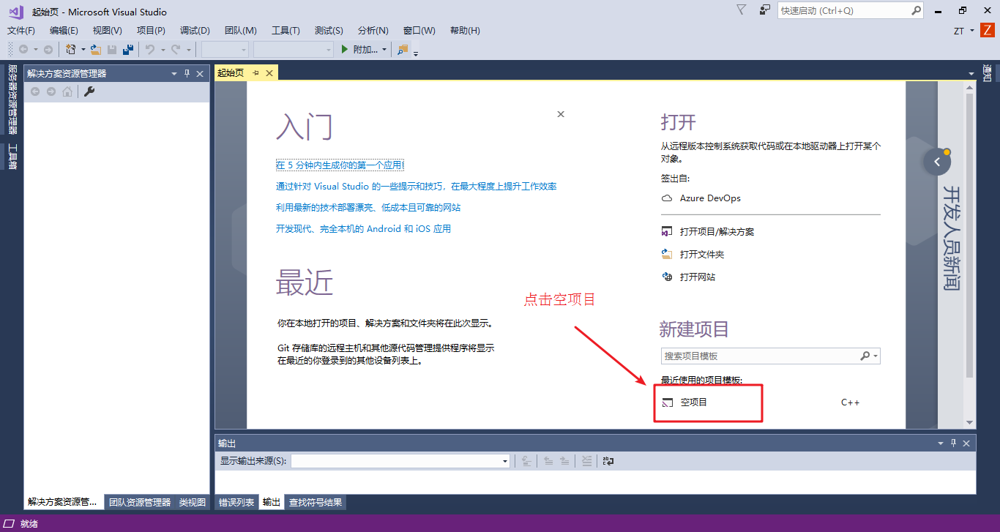
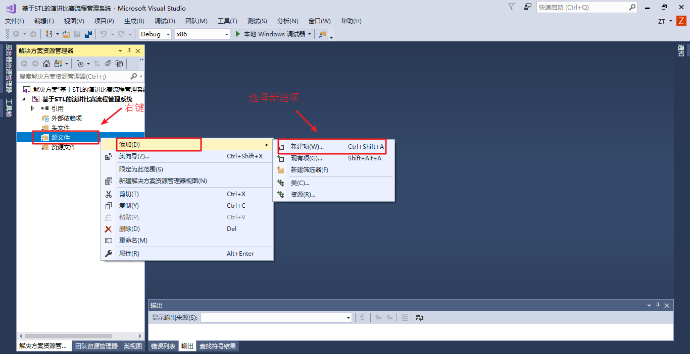
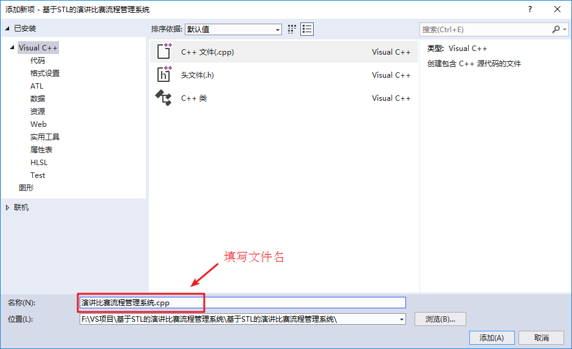
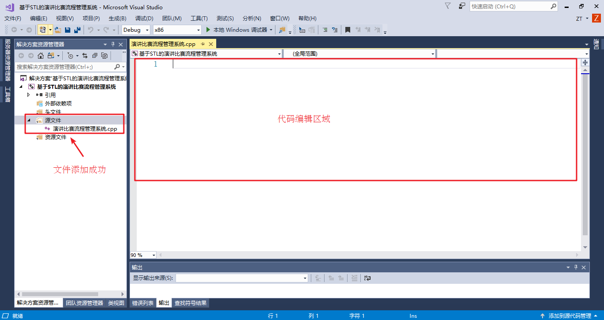
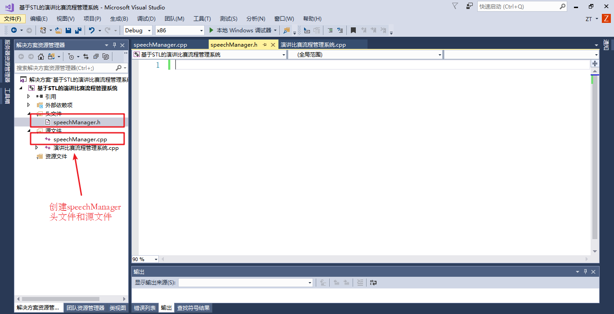

# 演讲比赛流程管理系统

---

## 演讲比赛程序需求


### 比赛规则

* 学校举行一场演讲比赛，共有 **12** 个人参加。**比赛共两轮**，第一轮为淘汰赛，第二轮为决赛
* 比赛方式：**分组比赛，每组 6 个人**；选手每次要随机分组，进行比赛
* 每名选手都有对应的 **编号**，如 10001 ~ 10012 
* 第一轮分为两个小组，每组 6 个人。整体按照选手编号进行 **抽签** 后顺序演讲
* 当小组演讲完后，淘汰组内排名最后的三个选手，**前三名晋级**，进入下一轮的比赛
* 第二轮为决赛，**前三名胜出**
* 每轮比赛过后需要 **显示晋级选手的信息**

### 程序功能

* 开始演讲比赛：完成整届比赛的流程，每个比赛阶段需要给用户一个提示，用户按任意键后继续下一个阶段
* 查看往届记录：查看之前比赛前三名结果，每次比赛都会记录到文件中，文件用 `.csv` 后缀名保存
* 清空比赛记录：将文件中数据清空
* 退出比赛程序：可以退出当前程序

### 程序效果

```sh
********************************************
*************  欢迎参加演讲比赛 ************
*************  1.开始演讲比赛  *************
*************  2.查看往届记录  *************
*************  3.清空比赛记录  *************
*************  0.退出比赛程序  *************
********************************************

请输入您的选择:
```

---

## 项目创建

创建项目步骤如下：

* 创建新项目
* 添加文件

### 创建项目

* 打开 vs 2022 后，点击创建新项目，创建新的 C++ 项目

如图：



* 填写项目名称以及选取项目路径，点击确定生成项目


### 添加文件

* 右键源文件，进行添加文件操作



* 填写文件名称，点击添加



* 生成文件成功，效果如下图



* 至此，项目已创建完毕

---

## 创建管理类

**功能描述**：

* 提供菜单界面与用户交互
* 对演讲比赛流程进行控制
* 与文件的读写交互

### 创建文件

* 在头文件和源文件的文件夹下分别创建 `speechManager.h` 和 `speechManager.cpp` 文件



### 头文件实现

在 `speechManager.h` 中设计管理类

code:

```cpp
#pragma once
#include <iostream>

using namespace std;

// 演讲管理类
class SpeechManager
{
public:
    // 构造函数
    SpeechManager();

    // 析构函数
    ~SpeechManager();
};
```

### 源文件实现

在 `speechManager.cpp` 中将构造和析构函数空实现补全

code:

```cpp
#include "speechManager.h"

// 构造函数
SpeechManager::SpeechManager()
{
}

// 析构函数
SpeechManager::~SpeechManager()
{
}
```

* 至此演讲管理类以创建完毕

---

## 菜单功能

**功能描述**：

与用户的沟通界面

### 添加成员函数

在管理类 `speechManager.h` 中添加成员函数 `void showMenu();`

```cpp
// 展示菜单
void showMenu();
```

### 菜单功能实现

* 在管理类 `speechManager.cpp` 中实现 `showMenu()` 函数

```cpp
// 展示菜单
void SpeechManager::showMenu()
{
    cout << "********************************************" << endl;
    cout << "*************  欢迎参加演讲比赛 ************" << endl;
    cout << "*************  1.开始演讲比赛  *************" << endl;
    cout << "*************  2.查看往届记录  *************" << endl;
    cout << "*************  3.清空比赛记录  *************" << endl;
    cout << "*************  0.退出比赛程序  *************" << endl;
    cout << "********************************************" << endl;
    cout << endl;
}
```

### 测试菜单功能

* 在 `main.cpp` 中测试菜单功能

```cpp
#include <iostream>
#include "speechManager.h"

using namespace std;

void test();

int main()
{
	SpeechManager sp;
	sp.showMenu();

	/*
	 */

	return 0;
}
```

* 运行结果如下：

```shell
********************************************
*************  欢迎参加演讲比赛 ************
*************  1.开始演讲比赛  *************
*************  2.查看往届记录  *************
*************  3.清空比赛记录  *************
*************  0.退出比赛程序  *************
********************************************

```

* 菜单界面搭建完毕

---

## 退出功能

### 提供功能接口

* 在 `main` 函数中提供分支选择，提供每个功能接口

code:

```cpp
int main()
{
	SpeechManager sp;
    // 用来存储用户的选项
	int choice = 0; 
	while (true)
	{
		sp.showMenu();
		cout << "请输入您的选择： " << endl;
		// 接受用户的选项
		cin >> choice;

		switch (choice)
		{
		case 1:
			// 开始比赛
			break;
		case 2:
			// 查看记录
			break;
		case 3:
			// 清空记录
			break;
		case 0:
			// 退出系统
			break;
		default:
			// 清屏
			system("clear");
			break;
		}
	}

	/*
	 */

	return 0;
}
```

### 实现退出功能

在 `speechManager.h` 中提供退出系统的成员函数 `void exitSystem();`

```cpp
// 退出系统
void exitSystem();
```

在 `speechManager.cpp` 中提供具体的功能实现

```cpp
// 退出系统
void SpeechManager::exitSystem()
{
    cout << "欢迎下次使用" << endl;
    exit(0);
}
```

### 测试功能

在 `main` 函数分支 0 选项中，调用退出程序的接口

```cpp
case 0:
    // 退出系统
	sp.exitSystem();
	break;
```

运行测试效果如图：

```shell
********************************************
*************  欢迎参加演讲比赛 ************
*************  1.开始演讲比赛  *************
*************  2.查看往届记录  *************
*************  3.清空比赛记录  *************
*************  0.退出比赛程序  *************
********************************************

请输入您的选择： 
0
欢迎下次使用
```

---

## 演讲比赛功能

### 功能分析

比赛流程分析：

* 抽签 → 开始演讲比赛 → 显示第一轮比赛结果 → 抽签 → 开始演讲比赛 → 显示前三名结果 → 保存分数

### 创建选手类

* 选手类中的属性包含：选手姓名、分数
* 头文件中创建 `speaker.h` 文件，并添加代码

code:

```cpp
#pragma once
#include <iostream>

using namespace std;

class Speaker
{
public:
    // 姓名
    string name;

    // 至多两轮得分
    double score[2];
};
```

### 比赛

#### 成员属性添加

* 在 `speechManager.h` 中添加属性

```cpp
// 比赛选手容器，12 人
vector<int> player;

// 第一轮晋级容器，6 人
vector<int> playerRound;

// 胜利前三名容器，3 人
vector<int> playerVictory;

// 存放编号以及对应具体选手的容器
map<int, Speaker> speakers;

// 比赛轮数
int round;
```

#### 初始化属性

* 在 `speechManager.h` 中提供开始比赛的成员函数 `void initSpeech();`

```cpp
// 初始化属性
void initSpeech();
```

* 在 `speechManager.cpp` 中实现 `void initSpeech();`

```cpp
// 初始化属性
void SpeechManager::initSpeech()
{
    // 清空所有容器
    this->player.clear();
    this->playerRound.clear();
    this->playerVictory.clear();
    this->speakers.clear();
    // 初始化比赛轮数
    this->round = 1;
}
```

* `SpeechManager` 构造函数中调用 `void initSpeech();`

```cpp
// 构造函数
SpeechManager::SpeechManager()
{
    // 初始化属性
    this->initSpeech();
}
```

#### 创建选手

* 在 `speechManager.h` 中提供开始比赛的的成员函数 `void createSpeaker();`

```cpp
// 初始化创建 12 名选手
void createSpeaker();
```

* 在 `speechManager.cpp` 中实现 `void createSpeaker();`

```cpp
// 初始化创建 12 名选手
void SpeechManager::createSpeaker()
{
    string nameStr = "ABCDEFGHIJKL";
    for (int i = 0; i < nameStr.size(); i++)
    {
        string name = "选手";
        name += nameStr[i];

        Speaker speaker;
        speaker.name = name;
        for (int j = 0; j < 2; j++)
        {
            speaker.score[j] = 0;
        }

        // 选手编号
        int id = i + 10001;
        this->player.push_back(id);

        // 选手编号以及对应的选手存放到 map 容器中
        this->speakers.insert(make_pair(id, speaker));
    }
}
```

* `SpeechManager` 类的构造函数中调用 `void createSpeaker();`

```cpp
// 构造函数
SpeechManager::SpeechManager()
{
    // 初始化属性
    this->initSpeech();
    // 创建选手
    this->createSpeaker();
}
```

* 测试，在 `main` 函数中，可以在创建完管理对象后，使用下列代码测试 12 名选手初始状态

```cpp
SpeechManager sp;
// test
for (auto it = sp.speakers.begin(); it != sp.speakers.end(); it++)
{
    cout << "选手编号：" << it->first
		 << " 姓名： " << it->second.name
		 << " 成绩： " << it->second.score[0] << endl;
}

// 用来存储用户的选项
int choice = 0; 
```

* 测试效果如下

```shell
选手编号：10001 姓名： 选手A 成绩： 0
选手编号：10002 姓名： 选手B 成绩： 0
选手编号：10003 姓名： 选手C 成绩： 0
选手编号：10004 姓名： 选手D 成绩： 0
选手编号：10005 姓名： 选手E 成绩： 0
选手编号：10006 姓名： 选手F 成绩： 0
选手编号：10007 姓名： 选手G 成绩： 0
选手编号：10008 姓名： 选手H 成绩： 0
选手编号：10009 姓名： 选手I 成绩： 0
选手编号：10010 姓名： 选手J 成绩： 0
选手编号：10011 姓名： 选手K 成绩： 0
选手编号：10012 姓名： 选手L 成绩： 0
********************************************
*************  欢迎参加演讲比赛 ************
*************  1.开始演讲比赛  *************
*************  2.查看往届记录  *************
*************  3.清空比赛记录  *************
*************  0.退出比赛程序  *************
********************************************

请输入您的选择： 

```

* 测试完毕后，可以将测试代码删除或注释

#### 开始比赛成员函数添加

* 在 `speechManager.h` 中提供开始比赛的的成员函数 `void startSpeech();`
* 该函数功能是主要控制比赛的流程

```cpp
// 开始比赛 - 比赛流程控制
void startSpeech();
```

* 在 `speechManager.cpp` 中将 `startSpeech` 的空实现先写入
* 可以先将整个比赛的流程写到函数中

```cpp
// 开始比赛 - 比赛流程控制
void SpeechManager::startSpeech()
{
    // 第一轮比赛
    // 抽签

    // 比赛

    // 显示晋级结果

    //第二轮比赛

    // 抽签

    // 比赛

    // 显示最终结果

    // 保存分数
}
```

#### 抽签

**功能描述**：

* 正式比赛前，所有选手的比赛顺序需要打乱，只需将存放选手编号的容器打乱次序即可
* 在 `speechManager.h` 中提供抽签的的成员函数 `void speechDraw();`

```cpp
// 抽签
void speechDraw();
```

在 `speechManager.cpp` 中实现成员函数 `void speechDraw();`

```cpp
// 抽签
void SpeechManager::speechDraw()
{
    cout << "第 << " << this->round << " >> 轮比赛选手正在抽签" << endl;
    cout << "---------------------" << endl;
    cout << "抽签后演讲顺序如下：" << endl;
    if (this->round == 1)
    {
        // 第一轮
        random_shuffle(this->player.begin(), this->player.end());
        for (vector<int>::iterator it = this->player.begin(); it != this->player.end(); it++)
        {
            cout << *it << endl;
        }
        cout << endl;
    }
    else
    {
        // 第二轮
        random_shuffle(this->playerRound.begin(), this->playerRound.end());
        for (vector<int>::iterator it = this->playerRound.begin(); it != this->playerRound.end(); it++)
        {
            cout << *it << endl;
        }
        cout << endl;
    }
    cout << "---------------------" << endl;
    cout << endl;
}
```

* 在 `startSpeech` 比赛流程控制的函数中，调用抽签函数

```cpp
// 第一轮比赛
// 抽签
this->speechDraw();
```

* 在 `main` 函数中，分支 1 选项中，调用开始比赛的接口

```cpp
case 1:
	// 开始比赛
    sp.startSpeech();
    break;
```

* 测试

```shell
********************************************
*************  欢迎参加演讲比赛 ************
*************  1.开始演讲比赛  *************
*************  2.查看往届记录  *************
*************  3.清空比赛记录  *************
*************  0.退出比赛程序  *************
********************************************

请输入您的选择： 
1
第 << 1 >> 轮比赛选手正在抽签
---------------------
抽签后演讲顺序如下：
10005 10011 10012 10009 10001 10006 10003 10002 10007 10010 10004 10008 
---------------------

```

#### 开始比赛

* 在 `speechManager.h` 中提供比赛的的成员函数 `void speechContest();`

```cpp
// 比赛
void speechContest();
```

* 在 `speechManager.cpp` 中实现成员函数 `void speechContest();`

```cpp
// 比赛
void SpeechManager::speechContest()
{
    // 随机数种子
    srand((unsigned int)time(NULL));

    cout << "------------- 第" << this->round << "轮正式比赛开始：------------- " << endl;
    // 临时容器，保存 key 分数 value 选手编号
    multimap<double, int, greater<int>> groupScore;
    // 记录人员数，6 个为 1 组
    int num = 0;
    // 比赛人员容器
    vector<int> vScore;

    if (this->round == 1)
    {
        vScore = this->player;
    }
    else
    {
        vScore = this->playerRound;
    }

    // 遍历所有参赛选手
    for (vector<int>::iterator it = vScore.begin(); it != vScore.end(); it++)
    {
        num++;

        // 打分
        deque<double> d;
        for (int i = 0; i < 10; i++)
        {
            double score = (rand() % 401 + 600) / 10.f;
            d.push_back(score);
        }

        // 排序
        sort(d.begin(), d.end(), greater<double>());
        // 去掉最高分与最低分
        d.pop_front();
        d.pop_back();

        double sum = accumulate(d.begin(), d.end(), 0.0f);
        double avg = sum / (double)d.size();

        // 每个人的平均分
        this->speakers[*it].score[this->round - 1] = avg;

        // 6 个人一组，用临时容器保存
        groupScore.insert(make_pair(avg, *it));

        if (num % 6 == 0)
        {
            cout << "第" << num / 6 << "小组比赛名次：" << endl;
            for (multimap<double, int, greater<int>>::iterator it = groupScore.begin(); it != groupScore.end(); it++)
            {
                cout << "编号: " << it->second << " 姓名： " << this->speakers[it->second].name << " 成绩： " << this->speakers[it->second].score[this->round - 1] << endl;
            }

            int count = 0;
            // 取前三名
            for (multimap<double, int, greater<int>>::iterator it = groupScore.begin(); it != groupScore.end() && count < 3; it++, count++)
            {
                if (this->round == 1)
                {
                    this->playerRound.push_back((*it).second);
                }
                else
                {
                    this->playerVictory.push_back((*it).second);
                }
            }

            groupScore.clear();
            cout << endl;
        }
    }
    cout << "------------- 第" << this->round << "轮比赛完毕  ------------- " << endl;
}
```

* 在 `startSpeech` 比赛流程控制的函数中，调用比赛函数

```cpp
// 比赛
this->speechContest();

// 显示晋级结果
```

* 再次运行代码，测试比赛

```shell
********************************************
*************  欢迎参加演讲比赛 ************
*************  1.开始演讲比赛  *************
*************  2.查看往届记录  *************
*************  3.清空比赛记录  *************
*************  0.退出比赛程序  *************
********************************************

请输入您的选择： 
1
第 << 1 >> 轮比赛选手正在抽签
---------------------
抽签后演讲顺序如下：
10005 10011 10012 10009 10001 10006 10003 10002 10007 10010 10004 10008 
---------------------

------------- 第1轮正式比赛开始：------------- 
第1小组比赛名次：
编号: 10005 姓名： 选手E 成绩： 84.5625
编号: 10006 姓名： 选手F 成绩： 83.3375
编号: 10009 姓名： 选手I 成绩： 81.2375
编号: 10011 姓名： 选手K 成绩： 79.7625
编号: 10012 姓名： 选手L 成绩： 79.85
编号: 10001 姓名： 选手A 成绩： 72.875

第2小组比赛名次：
编号: 10003 姓名： 选手C 成绩： 86.15
编号: 10008 姓名： 选手H 成绩： 84.325
编号: 10007 姓名： 选手G 成绩： 80.525
编号: 10004 姓名： 选手D 成绩： 79.5625
编号: 10002 姓名： 选手B 成绩： 78.925
编号: 10010 姓名： 选手J 成绩： 77.9375

```

#### 显示比赛分数

* 在 `speechManager.h` 中提供比赛的的成员函数 `void showScore();`

```cpp
// 显示比赛结果
void showScore();
```

* 在 `speechManager.cpp` 中实现成员函数 `void showScore();`

```cpp
// 显示比赛结果
void SpeechManager::showScore()
{
    cout << "---------第" << this->round << "轮晋级选手信息如下：-----------" << endl;
    vector<int> v;

    if (this->round == 1)
    {
        v = playerRound;
    }
    else
    {
        v = playerVictory;
    }

    for (vector<int>::iterator it = v.begin(); it != v.end(); it++)
    {
        cout << "选手编号：" << *it << " 姓名： " << this->speakers[*it].name << " 得分： " << this->speakers[*it].score[this->round - 1] << endl;
    }
    cout << endl;
}
```

* 在 `startSpeech` 比赛流程控制的函数中，调用显示比赛分数函数

```cpp
// 显示晋级结果
this->showScore();
```

* 运行代码，测试效果

```shell
********************************************
*************  欢迎参加演讲比赛 ************
*************  1.开始演讲比赛  *************
*************  2.查看往届记录  *************
*************  3.清空比赛记录  *************
*************  0.退出比赛程序  *************
********************************************

请输入您的选择： 
1
第 << 1 >> 轮比赛选手正在抽签
---------------------
抽签后演讲顺序如下：
10005 10011 10012 10009 10001 10006 10003 10002 10007 10010 10004 10008 
---------------------

------------- 第1轮正式比赛开始：------------- 
第1小组比赛名次：
编号: 10005 姓名： 选手E 成绩： 83.7
编号: 10001 姓名： 选手A 成绩： 82.6625
编号: 10011 姓名： 选手K 成绩： 80.525
编号: 10009 姓名： 选手I 成绩： 80.9
编号: 10006 姓名： 选手F 成绩： 80.9625
编号: 10012 姓名： 选手L 成绩： 72.85

第2小组比赛名次：
编号: 10010 姓名： 选手J 成绩： 89.2375
编号: 10007 姓名： 选手G 成绩： 88.2875
编号: 10004 姓名： 选手D 成绩： 81.15
编号: 10008 姓名： 选手H 成绩： 80.95
编号: 10003 姓名： 选手C 成绩： 77.8375
编号: 10002 姓名： 选手B 成绩： 75.9375

------------- 第1轮比赛完毕  ------------- 
---------第1轮晋级选手信息如下：-----------
选手编号：10005 姓名： 选手E 得分： 83.7
选手编号：10001 姓名： 选手A 得分： 82.6625
选手编号：10011 姓名： 选手K 得分： 80.525
选手编号：10010 姓名： 选手J 得分： 89.2375
选手编号：10007 姓名： 选手G 得分： 88.2875
选手编号：10004 姓名： 选手D 得分： 81.15

```

#### 第二轮比赛

第二轮比赛流程同第一轮，只是比赛的轮是 +1，其余流程不变

* 在 `startSpeech` 比赛流程控制的函数中，加入第二轮的流程

```cpp
// 第二轮比赛
this->round++;

// 抽签
this->speechDraw();

// 比赛
this->speechContest();

// 显示最终结果
this->showScore();
```

* 测试，将整个比赛流程都跑通

```shell
********************************************
*************  欢迎参加演讲比赛 ************
*************  1.开始演讲比赛  *************
*************  2.查看往届记录  *************
*************  3.清空比赛记录  *************
*************  0.退出比赛程序  *************
********************************************

请输入您的选择： 
1
第 << 1 >> 轮比赛选手正在抽签
---------------------
抽签后演讲顺序如下：
10005 10011 10012 10009 10001 10006 10003 10002 10007 10010 10004 10008 
---------------------

------------- 第1轮正式比赛开始：------------- 
第1小组比赛名次：
编号: 10011 姓名： 选手K 成绩： 86.0875
编号: 10001 姓名： 选手A 成绩： 84.5
编号: 10009 姓名： 选手I 成绩： 80.2375
编号: 10005 姓名： 选手E 成绩： 78.3125
编号: 10012 姓名： 选手L 成绩： 78.4875
编号: 10006 姓名： 选手F 成绩： 77.7

第2小组比赛名次：
编号: 10003 姓名： 选手C 成绩： 88.05
编号: 10007 姓名： 选手G 成绩： 85.975
编号: 10002 姓名： 选手B 成绩： 83.125
编号: 10004 姓名： 选手D 成绩： 83.7875
编号: 10010 姓名： 选手J 成绩： 80.875
编号: 10008 姓名： 选手H 成绩： 78.4625

------------- 第1轮比赛完毕  ------------- 
---------第1轮晋级选手信息如下：-----------
选手编号：10011 姓名： 选手K 得分： 86.0875
选手编号：10001 姓名： 选手A 得分： 84.5
选手编号：10009 姓名： 选手I 得分： 80.2375
选手编号：10003 姓名： 选手C 得分： 88.05
选手编号：10007 姓名： 选手G 得分： 85.975
选手编号：10002 姓名： 选手B 得分： 83.125

********************************************
*************  欢迎参加演讲比赛 ************
*************  1.开始演讲比赛  *************
*************  2.查看往届记录  *************
*************  3.清空比赛记录  *************
*************  0.退出比赛程序  *************
********************************************

第 << 2 >> 轮比赛选手正在抽签
---------------------
抽签后演讲顺序如下：
10002 10001 10009 10003 10007 10011 
---------------------

------------- 第2轮正式比赛开始：------------- 
第1小组比赛名次：
编号: 10001 姓名： 选手A 成绩： 86.0875
编号: 10007 姓名： 选手G 成绩： 84.5
编号: 10003 姓名： 选手C 成绩： 80.2375
编号: 10002 姓名： 选手B 成绩： 78.3125
编号: 10009 姓名： 选手I 成绩： 78.4875
编号: 10011 姓名： 选手K 成绩： 77.7

------------- 第2轮比赛完毕  ------------- 
---------第2轮晋级选手信息如下：-----------
选手编号：10001 姓名： 选手A 得分： 86.0875
选手编号：10007 姓名： 选手G 得分： 84.5
选手编号：10003 姓名： 选手C 得分： 80.2375

```

### 保存分数

**功能描述**：

* 将每次演讲比赛的得分记录到文件中

**功能实现**：

* 在 `speechManager.h` 中添加保存记录的成员函数 `void saveRecord();`

```cpp
// 保存记录
void saveRecord();
```

* 在 `speechManager.cpp` 中实现成员函数 `void saveRecord();`

```cpp
// 保存记录
void SpeechManager::saveRecord()
{
    ofstream ofs;
    ofs.open("speech.csv", ios::out | ios::app);

    // 将每个人数据写入到文件中
    for (vector<int>::iterator it = this->playerVictory.begin(); it != this->playerVictory.end(); it++)
    {
        ofs << *it << ","
            << this->speakers[*it].score[1] << ",";
    }
    ofs << endl;
    ofs.close();

    cout << "记录已经保存" << endl;
}
```

* 在 `startSpeech` 比赛流程控制的函数中，最后调用保存记录分数函数

```cpp
// 保存分数
this->saveRecord();
cout << "本届比赛结束!" << endl;
```

* 测试，整个比赛完毕后记录保存情况

```shell
********************************************
*************  欢迎参加演讲比赛 ************
*************  1.开始演讲比赛  *************
*************  2.查看往届记录  *************
*************  3.清空比赛记录  *************
*************  0.退出比赛程序  *************
********************************************

请输入您的选择： 
1
第 << 1 >> 轮比赛选手正在抽签
---------------------
抽签后演讲顺序如下：
10005 10011 10012 10009 10001 10006 10003 10002 10007 10010 10004 10008 
---------------------

------------- 第1轮正式比赛开始：------------- 
第1小组比赛名次：
编号: 10005 姓名： 选手E 成绩： 85.0125
编号: 10001 姓名： 选手A 成绩： 82.85
编号: 10012 姓名： 选手L 成绩： 81.5
编号: 10011 姓名： 选手K 成绩： 80.2125
编号: 10006 姓名： 选手F 成绩： 80.225
编号: 10009 姓名： 选手I 成绩： 78.625

第2小组比赛名次：
编号: 10007 姓名： 选手G 成绩： 84.6125
编号: 10010 姓名： 选手J 成绩： 83.2125
编号: 10004 姓名： 选手D 成绩： 83.6375
编号: 10003 姓名： 选手C 成绩： 82.6375
编号: 10002 姓名： 选手B 成绩： 76.6125
编号: 10008 姓名： 选手H 成绩： 74.3625

------------- 第1轮比赛完毕  ------------- 
---------第1轮晋级选手信息如下：-----------
选手编号：10005 姓名： 选手E 得分： 85.0125
选手编号：10001 姓名： 选手A 得分： 82.85
选手编号：10012 姓名： 选手L 得分： 81.5
选手编号：10007 姓名： 选手G 得分： 84.6125
选手编号：10010 姓名： 选手J 得分： 83.2125
选手编号：10004 姓名： 选手D 得分： 83.6375

********************************************
*************  欢迎参加演讲比赛 ************
*************  1.开始演讲比赛  *************
*************  2.查看往届记录  *************
*************  3.清空比赛记录  *************
*************  0.退出比赛程序  *************
********************************************

第 << 2 >> 轮比赛选手正在抽签
---------------------
抽签后演讲顺序如下：
10005 10007 10010 10012 10001 10004 
---------------------

------------- 第2轮正式比赛开始：------------- 
第1小组比赛名次：
编号: 10005 姓名： 选手E 成绩： 85.0125
编号: 10001 姓名： 选手A 成绩： 82.85
编号: 10010 姓名： 选手J 成绩： 81.5
编号: 10007 姓名： 选手G 成绩： 80.2125
编号: 10004 姓名： 选手D 成绩： 80.225
编号: 10012 姓名： 选手L 成绩： 78.625

------------- 第2轮比赛完毕  ------------- 
---------第2轮晋级选手信息如下：-----------
选手编号：10005 姓名： 选手E 得分： 85.0125
选手编号：10001 姓名： 选手A 得分： 82.85
选手编号：10010 姓名： 选手J 得分： 81.5

********************************************
*************  欢迎参加演讲比赛 ************
*************  1.开始演讲比赛  *************
*************  2.查看往届记录  *************
*************  3.清空比赛记录  *************
*************  0.退出比赛程序  *************
********************************************

记录已经保存
本届比赛结束!
```

* 利用记事本打开文件 `speech.csv`，里面保存了前三名选手的编号以及得分

```csv
10005,85.0125,10001,82.85,10010,81.5,

```

* 至此，整个演讲比赛功能制作完毕

---

## 查看纪录

### 读取记录分数

* 在 `speechManager.h` 中添加保存记录的成员函数 `void loadRecord();`
* 添加判断文件是否为空的标志 `bool fileIsEmpty;`
* 添加往届记录的容器 `map<int, vector<string>> record;`

其中 `record` 中的 `key` 代表第几届，`value` 记录具体的信息

```cpp
// 文件为空的标志
bool fileIsEmpty;

// 往届记录
map<int, vector<string>> record;

// 读取记录
void loadRecord();
```

* 在 `speechManager.cpp` 中实现成员函数 `void loadRecord();`

```cpp
// 读取记录
void SpeechManager::loadRecord()
{
    ifstream ifs;
    ifs.open("speech.csv", ios::in);

    if (!ifs.is_open())
    {
        this->fileIsEmpty = true;
        cout << "文件不存在!" << endl;
        ifs.close();
        return;
    }

    char ch;
    ifs >> ch;
    if (ifs.eof())
    {
        cout << "文件为空!" << endl;
        this->fileIsEmpty = true;
        ifs.close();
        return;
    }

    // 文件存在且不为空
    this->fileIsEmpty = false;

    ifs.putback(ch);

    string data;
    int idx = 0;
    while (ifs >> data)
    {
        vector<string> v;
        int pos = -1;
        int start = 0;

        while (true)
        {
            pos = data.find(",", start);

            if (pos == -1)
            {
                break;
            }

            string temp = data.substr(start, pos - start);
            v.push_back(temp);
            start = pos + 1;
        }
        this->record.insert(make_pair(idx, v));
        idx++;
    }
    ifs.close();
}
```

* 在 `SpeechManager` 构造函数中调用获取往届记录函数

```cpp
// 获取往届比赛纪录
this->loadRecord();
```

### 查看记录功能

* 在 `speechManager.h` 中添加保存记录的成员函数 `void showRecord();`

```cpp
// 显示往届得分
void showRecord();
```

* 在 `speechManager.cpp` 中实现成员函数 `void showRecord();`

```cpp
// 显示往届得分
void SpeechManager::showRecord()
{
    for (int i = 0; i < this->record.size(); i++)
    {
        cout << "第" << i + 1 << "届 "
             << "冠军编号：" << this->record[i][0] << " 得分：" << this->record[i][1]
             << "亚军编号：" << this->record[i][2] << " 得分：" << this->record[i][3]
             << "季军编号：" << this->record[i][4] << " 得分：" << this->record[i][5] << endl;
    }
}
```

### 测试功能

在 `main` 函数分支 2 选项中，调用查看记录的接口

```cpp
case 2:
    // 查看记录
	sp.showRecord();
	break;
```

显示效果如图(本次测试添加了 4 条记录):

```shell
********************************************
*************  欢迎参加演讲比赛 ************
*************  1.开始演讲比赛  *************
*************  2.查看往届记录  *************
*************  3.清空比赛记录  *************
*************  0.退出比赛程序  *************
********************************************

请输入您的选择： 
2
第1届 冠军编号：10005 得分：85.0125亚军编号：10001 得分：82.85季军编号：10010 得分：81.5
第2届 冠军编号：10009 得分：90.6875亚军编号：10002 得分：82.175季军编号：10007 得分：80.6375
第3届 冠军编号：10009 得分：78.8625亚军编号：10002 得分：80.9625季军编号：10007 得分：77.1375
第4届 冠军编号：10009 得分：78.8625亚军编号：10002 得分：80.9625季军编号：10007 得分：77.1375
第5届 冠军编号：10009 得分：78.8625亚军编号：10002 得分：80.9625季军编号：10007 得分：77.1375
```

### bug 解决

目前程序中有几处 bug 未解决：

* 查看往届记录，若文件不存在或为空，并未提示

解决方式：在 `showRecord` 函数中，开始判断文件状态并加以判断

```cpp
// 显示往届得分
void SpeechManager::showRecord()
{
    if (this->fileIsEmpty)
    {
        cout << "文件不存在或者无纪录" << endl;
    }
    else
    {
        for (int i = 0; i < this->record.size(); i++)
        {
            cout << "第" << i + 1 << "届 "
                 << "冠军编号：" << this->record[i][0] << " 得分：" << this->record[i][1]
                 << "亚军编号：" << this->record[i][2] << " 得分：" << this->record[i][3]
                 << "季军编号：" << this->record[i][4] << " 得分：" << this->record[i][5] << endl;
        }
    }
}
```

* 若记录为空或不存在，比完赛后依然提示记录为空

解决方式：`saveRecord` 中更新文件为空的标志

```cpp
// 保存记录
void SpeechManager::saveRecord()
{
    ofstream ofs;
    ofs.open("speech.csv", ios::out | ios::app);

    // 将每个人数据写入到文件中
    for (vector<int>::iterator it = this->playerVictory.begin(); it != this->playerVictory.end(); it++)
    {
        ofs << *it << ","
            << this->speakers[*it].score[1] << ",";
    }
    ofs << endl;
    ofs.close();

    cout << "记录已经保存" << endl;

    // 已经保存了纪录，文件有了纪录也就不为空了
    this->fileIsEmpty = false;
}
```

* 比完赛后查不到本届比赛的记录，没有实时更新

解决方式：比赛完毕后，所有数据重置

```cpp
// 开始比赛 - 比赛流程控制
void SpeechManager::startSpeech()
{
    // 第一轮比赛
    // 抽签
    this->speechDraw();

    // 比赛
    this->speechContest();

    // 显示晋级结果
    this->showScore();

    // 第二轮比赛
    this->round++;

    // 抽签
    this->speechDraw();

    // 比赛
    this->speechContest();

    // 显示最终结果
    this->showScore();

    // 保存分数
    this->saveRecord();

    // 重置比赛
    // 初始化相关属性
    this->initSpeech();

    // 重新创建选手
    this->createSpeaker();

    // 获取往届比赛纪录
    this->loadRecord();

    cout << "本届比赛结束!" << endl;
}
```

* 在初始化时，没有初始化记录容器

解决方式：`initSpeech` 中添加初始化记录容器

```cpp
// 初始化属性
void SpeechManager::initSpeech()
{
    // 清空所有容器
    this->player.clear();
    this->playerRound.clear();
    this->playerVictory.clear();
    this->speakers.clear();
    // 初始化比赛轮数
    this->round = 1;
    // 初始化纪录容器
    this->record.clear();
}
```

* 每次记录都是一样的

解决方式：添加随机数种子

```cpp
srand((unsigned int)time(NULL));
```

所有 bug 解决后测试：

```shell
********************************************
*************  欢迎参加演讲比赛 ************
*************  1.开始演讲比赛  *************
*************  2.查看往届记录  *************
*************  3.清空比赛记录  *************
*************  0.退出比赛程序  *************
********************************************

请输入您的选择： 
2
第1届 冠军编号：10003 得分：84.025亚军编号：10012 得分：82.25季军编号：10005 得分：81.2375
第2届 冠军编号：10006 得分：88.2375亚军编号：10012 得分：83.8季军编号：10007 得分：83.05
第3届 冠军编号：10012 得分：84.6125亚军编号：10009 得分：82.6875季军编号：10001 得分：80.8625
第4届 冠军编号：10009 得分：87.4625亚军编号：10011 得分：79.475季军编号：10004 得分：78.9
第5届 冠军编号：10011 得分：87.4625亚军编号：10001 得分：79.475季军编号：10008 得分：78.9
第6届 冠军编号：10001 得分：83.475亚军编号：10007 得分：82.4875季军编号：10011 得分：82.8625
```

---

## 清空纪录

### 清空记录功能实现

* 在 `speechManager.h` 中添加保存记录的成员函数 `void clearRecord();`

```cpp
// 清空记录
void clearRecord();
```

* 在 `speechManager.cpp` 中实现成员函数 `void clearRecord();`

```cpp
// 清空记录
void SpeechManager::clearRecord()
{
    cout << "确认清空？" << endl;
    cout << "1、确认" << endl;
    cout << "2、返回" << endl;

    int select = 0;
    cin >> select;

    if (select == 1)
    {
        // 打开模式 ios::trunc 如果存在删除文件并重新创建
        ofstream ofs;
        ofs.open("speech.csv", ios::trunc);
        ofs.close();

        // 初始化属性
        this->initSpeech();

        // 创建选手
        this->createSpeaker();

        // 获取往届纪录
        this->loadRecord();

        cout << "清空成功!" << endl;
    }
 
    system("clear");
}
```

### 测试清空

* 在 `main` 函数分支 3 选项中，调用清空比赛记录的接口

```shell
case 3:
    // 清空记录
	sp.clearRecord();
	break;
```

* 运行程序，测试清空记录：

```shell
********************************************
*************  欢迎参加演讲比赛 ************
*************  1.开始演讲比赛  *************
*************  2.查看往届记录  *************
*************  3.清空比赛记录  *************
*************  0.退出比赛程序  *************
********************************************

请输入您的选择： 
3
确认清空？
1、确认
2、返回
1
清空成功!
```

* `speech.csv` 中记录也为空

```csv

```

至此本案例结束

---
