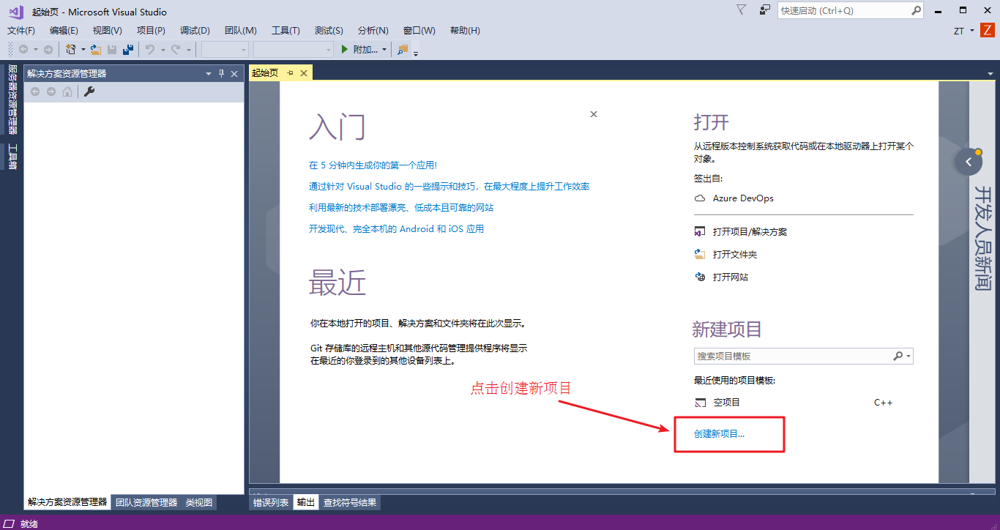
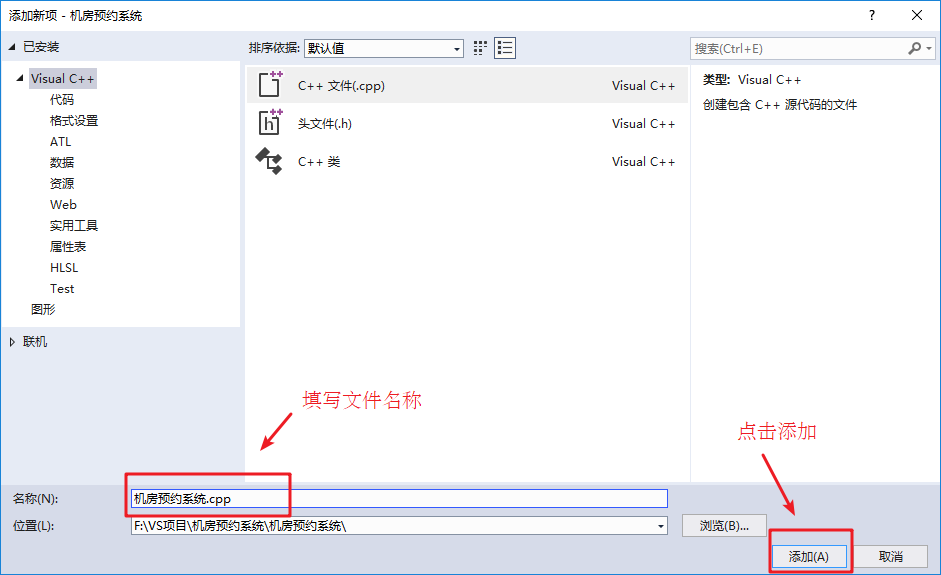

# 机房预约系统

---

## 机房预约系统需求

### 系统简介

* 学校现有几个规格不同的机房，由于使用时经常出现"撞车"现象，现开发一套机房预约系统，解决这一问题


### 身份简介

分别有三种身份使用该程序

* **学生代表**：申请使用机房
* **教师**：审核学生的预约申请
* **管理员**：给学生、教师创建账号

### 机房简介

机房总共有 3 间

* 1 号机房 --- 最大容量 20 人
* 2 号机房 --- 最多容量 50 人
* 3 号机房 --- 最多容量 100 人

### 申请简介

* 申请的订单每周由管理员负责清空
* 学生可以预约未来一周内的机房使用，预约的日期为周一至周五，预约时需要选择预约时段(上午、下午)
* 教师来审核预约，依据实际情况审核预约通过或者不通过

### 系统具体需求

* 首先进入登录界面，可选登录身份有
    * 学生代表
    * 老师
    * 管理员
    * 退出
* 每个身份都需要进行验证后，进入子菜单
    * 学生需要输入：学号、姓名、登录密码
    * 老师需要输入：职工号、姓名、登录密码
    * 管理员需要输入：管理员姓名、登录密码
* 学生具体功能
    * 申请预约 --- 预约机房
    * 查看自身的预约 --- 查看自己的预约状态
    * 查看所有预约 --- 查看全部预约信息以及预约状态
    * 取消预约 --- 取消自身的预约，预约成功或审核中的预约均可取消
    * 注销登录 --- 退出登录
* 教师具体功能
    * 查看所有预约 --- 查看全部预约信息以及预约状态
    * 审核预约 --- 对学生的预约进行审核
    * 注销登录 --- 退出登录
* 管理员具体功能
    * 添加账号 --- 添加学生或教师的账号，需要检测学生编号或教师职工号是否重复
    * 查看账号 --- 可以选择查看学生或教师的全部信息
    * 查看机房 --- 查看所有机房的信息
    * 清空预约 --- 清空所有预约记录
    * 注销登录 --- 退出登录


---

## 创建项目

创建项目步骤如下：

* 创建新项目
* 添加文件

### 创建项目

* 打开 vs 2022 后，点击创建新项目，创建新的 C++ 项目

如图：



* 填写项目名称以及选取项目路径，点击确定生成项目


### 添加文件

* 右键源文件，进行添加文件操作


* 填写文件名称，点击添加



* 生成文件成功，效果如下


---

## 创建主菜单

**功能描述**：

* 设计主菜单，与用户进行交互

### 菜单实现

* 在主函数 `main` 中添加菜单提示的函数 `void showMain()`，代码如下

```cpp
#include <iostream>

using namespace std;

// 主界面
void showMain();

int main()
{
	showMain();

	/*
	 */

	return 0;
}

void showMain()
{
	cout << "=====================  欢迎来到机房预约系统  ====================" << endl;
	cout << endl;
	cout << "请输入您的身份" << endl;
	cout << "\t\t -------------------------------\n";
	cout << "\t\t|                               |\n";
	cout << "\t\t|          1.学生代表           |\n";
	cout << "\t\t|                               |\n";
	cout << "\t\t|          2.老    师           |\n";
	cout << "\t\t|                               |\n";
	cout << "\t\t|          3.管 理 员           |\n";
	cout << "\t\t|                               |\n";
	cout << "\t\t|          0.退    出           |\n";
	cout << "\t\t|                               |\n";
	cout << "\t\t -------------------------------\n";
	cout << "输入您的选择: " << endl;
}
```

* 运行效果如下

```text
=====================  欢迎来到机房预约系统  ====================

请输入您的身份
                 -------------------------------
                |                               |
                |          1.学生代表           |
                |                               |
                |          2.老    师           |
                |                               |
                |          3.管 理 员           |
                |                               |
                |          0.退    出           |
                |                               |
                 -------------------------------
输入您的选择: 
```

### 搭建接口

* 接受用户的选择，搭建接口
* 在 `main` 中添加代码

```cpp
int main()
{
	int select = 0;

	while (true)
	{
		showMain();

		cin >> select;

		switch (select)
		{
		case 0:{
			// 退出系统
			break;
		}
		case 1:
		{
			// 学生身份
			break;
		}

		case 2:
		{
			// 教师身份
			break;
		}

		case 3:
		{
			// 管理员身份
			break;
		}

		default:
		{
			cout << "输入有误，请重新输入!" << endl;
			// system("clear");
			break;
		}
		}
	}

	/*
	 */

	return 0;
}
```

* 测试，输入 0、1、2、3 会重新回到界面，输入其他提示输入有误，清屏后重新选择。效果如下

```text
=====================  欢迎来到机房预约系统  ====================

请输入您的身份
                 -------------------------------
                |                               |
                |          1.学生代表           |
                |                               |
                |          2.老    师           |
                |                               |
                |          3.管 理 员           |
                |                               |
                |          0.退    出           |
                |                               |
                 -------------------------------
输入您的选择: 
4
输入有误，请重新输入!
```

至此，界面搭建完毕

---

## 退出功能实现

### 退出功能实现

* 在 `main` 函数分支 0 选项中，添加退出程序的代码

```cpp
case 0:
{
	// 退出系统
	cout << "欢迎下次使用!" << endl;
    return 0;
}
```

### 测试退出功能

* 运行程序，效果如下

```text
=====================  欢迎来到机房预约系统  ====================

请输入您的身份
                 -------------------------------
                |                               |
                |          1.学生代表           |
                |                               |
                |          2.老    师           |
                |                               |
                |          3.管 理 员           |
                |                               |
                |          0.退    出           |
                |                               |
                 -------------------------------
输入您的选择: 
0
欢迎下次使用!
```

至此，退出程序功能实现

---

## 创建身份类

### 身份的基类

* 在整个系统中，有三种身份，分别为：学生代表、老师以及管理员
* 三种身份有其共性也有其特性，因此我们可以将三种身份抽象出一个身份基类 **identity**
* 创建 `identity.h` 文件

```cpp
#pragma once
#include <iostream>

using namespace std;

class Identity
{
public:
    // 用户名
    string name;
    // 密码
    string password;

public:
    // 不同的用户有着不同的操作菜单
    virtual void operMenu() = 0;
};
```

### 学生类

#### 功能分析

学生类主要功能是可以通过类中成员函数，实现预约实验室操作

学生类中主要功能有：

* 显示学生操作的菜单界面
* 申请预约
* 查看自身预约
* 查看所有预约
* 取消预约

#### 类的创建

在头文件以及源文件下创建 `student.h` 和 `student.cpp` 文件

`student.h` 中添加如下代码：

```cpp
#pragma once
#include <iostream>
#include "identity.h"

using namespace std;

// 学生类
class Student : public Identity
{
private:
    int studentId;

public:
    // 无参构造
    Student();

    // 有参构造
    Student(int studentId, string name, string password);

    // studentId 的 get 的方法
    int getStudentId();

    // studentId 的 set 的方法
    void setStudentId(int studentId);

    // 菜单界面
    virtual void operMenu();

    // 申请预约
    void applyOrder();

    // 查看我的预约
    void showMyOrder();

    // 查看所有预约
    void showAllOrder();

    // 取消预约
    void canceOrder();
};
```

`student.cpp` 中添加如下代码，先实现 `studentId` 的 `get` 与 `set` 的方法

```cpp
#include "student.h"

// 无参构造
Student::Student()
{
}

// 有参构造
Student::Student(int studentId, string name, string password)
{
}

// studentId 的 get 的方法
int Student::getStudentId()
{
    return this->studentId;
}

// studentId 的 set 的方法
void Student::setStudentId(int studentId)
{
    this->studentId = studentId;
}

// 菜单界面
void Student::operMenu()
{
}

// 申请预约
void Student::applyOrder()
{
}

// 查看我的预约
void Student::showMyOrder()
{
}

// 查看所有预约
void Student::showAllOrder()
{
}

// 取消预约
void Student::canceOrder()
{
}
```

### 老师类

#### 功能分析

教师类主要功能是查看学生的预约，并进行审核

教师类中主要功能有

* 显示教师操作的菜单界面
* 查看所有预约
* 审核预约

#### 类的创建

在头文件以及源文件下创建 `teacher.h` 和 `teacher.cpp` 文件

`teacher.h` 中添加如下代码

```cpp
#pragma once
#include <iostream>
#include "identity.h"

using namespace std;

class Teacher : public Identity
{
private:
    int teacherId;

public:
    // 无参构造
    Teacher();

    // 有参构造
    Teacher(int teacherId, string name, string password);

    // teacherId 的 get 的方法
    int getTeacherId();

    // teacherId 的 set 的方法
    void setTeacherId(int teacherId);

    // 菜单界面
    virtual void operMenu();

    // 查看所有预约
    void showAllOrder();

    // 审核预约
    void validOrder();
};
```

`teacher.cpp` 中添加如下代码，实现 `teacherId` 的 `get` 与 `set` 的方法

```cpp
#include "teacher.h"

// 无参构造
Teacher::Teacher()
{
}

// 有参构造
Teacher::Teacher(int teacherId, string name, string password)
{
}

// teacherId 的 get 的方法
int Teacher::getTeacherId()
{
    return this->teacherId;
}

// teacherId 的 set 的方法
void Teacher::setTeacherId(int teacherId)
{
    this->teacherId = teacherId;
}

// 菜单界面
void Teacher::operMenu()
{
}

// 查看所有预约
void Teacher::showAllOrder()
{
}

// 审核预约
void Teacher::validOrder()
{
}
```

### 管理员类

#### 功能分析

管理员类主要功能是对学生和老师账户进行管理，查看机房信息以及清空预约记录

管理员类中主要功能有：

* 显示管理员操作的菜单界面
* 添加账号
* 查看账号
* 查看机房信息
* 清空预约记录

#### 类的创建

* 在头文件以及源文件下创建 `manager.h` 和 `manager.cpp` 文件

`manager.h` 中添加如下代码

```cpp
#pragma once
#include <iostream>
#include "identity.h"

using namespace std;

class Manager : public Identity
{
public:
    // 无参构造
    Manager();

    // 无参构造
    Manager(string name, string password);

    // 菜单界面
    virtual void operMenu();

    // 添加账号
    void addAccount();

    // 查看账号
    void showAccount();

    // 查看机房信息
    void showComputer();

    // 清除纪录
    void cleanRecord();
};
```

`manager.cpp` 中添加如下代码

```cpp
#include "manager.h"

// 无参构造
Manager::Manager()
{
}

// 无参构造
Manager::Manager(string name, string password)
{
}

// 菜单界面
void Manager::operMenu()
{
}

// 添加账号
void Manager::addAccount()
{
}

// 查看账号
void Manager::showAccount()
{
}

// 查看机房信息
void Manager::showComputer()
{
}

// 清除纪录
void Manager::cleanRecord()
{
}
```

至此，所有身份类创建完毕

---

## 登录模块

### 全局文件添加

**功能描述**：

* 不同的身份可能会用到不同的文件操作，我们可以将所有的文件名定义到一个全局的文件中
* 在头文件中添加 `globalFile.h` 文件
* 并添加如下代码

```cpp
#pragma once

// 管理员文件
#define ADMIN_FILE "admin.txt"
// 学生文件
#define STUDENT_FILE "student.txt"
// 教师文件
#define TEACHER_FILE "teacher.txt"
// 机房信息文件
#define COMPUTER_FILE "computerRoom.txt"
// 订单文件
#define ORDER_FILE "order.txt"
```

### 登录函数封装

**功能描述**：

* 根据用户的选择，进入不同的身份登录

在 `main.cpp` 文件中添加全局函数 `void loginIn(string fileName, int type)`

**参数**：

* `fileName` --- 操作的文件名
* `type` --- 登录的身份(1 代表学生、2 代表老师、3 代表管理员)

`loginIn(string fileName, int type)` 中添加如下代码

```cpp
void loginIn(string fileName, int type)
{
	Identity *person = NULL;

	ifstream ifs;
	ifs.open(fileName, ios::in);

	// 文件不存在
	if (!ifs.is_open())
	{
		cout << "文件不存在" << endl;
		ifs.close();
		return;
	}

	int id = 0;
	string name;
	string password;

	if (type == 1)
	{
		// 学生
		cout << "请输入学生学号:" << endl;
		cin >> id;
	}
	else if (type == 2)
	{
		// 教师
		cout << "请输入教职工号:" << endl;
		cin >> id;
	}
	else
	{
	}

	cout << "请输入用户名:" << endl;
	cin >> name;
	cout << "请输入密码:" << endl;
	cin >> password;

	if (type == 1)
	{
		// 学生登陆验证
	}
	else if (type == 2)
	{
		// 教师登陆验证
	}
	else
	{
		// 管理员登陆验证
	}

	cout << "验证登录失败!" << endl;
}
```

* 在 `main` 函数的不同分支中，填入不同的登录接口

```cpp
case 1:
{
    // 学生身份
	loginIn(STUDENT_FILE, 1);
	break;
}
case 2:
{
	// 教师身份
    loginIn(TEACHER_FILE, 2);
	break;
}
case 3:
{
    // 管理员身份
	loginIn(ADMIN_FILE, 3);
	break;
}
```

### 学生登录实现

在 `student.txt` 文件中添加两条学生信息，用于测试

添加信息:   

```text
1 张三 123
2 李四 123456
```

其中：

* 第一列代表 **学号**
* 第二列代表 **学生姓名**
* 第三列代表 **密码**

在 `loginIn` 函数的学生分支中加入如下代码，验证学生身份

```cpp
if (type == 1)
{
    // 学生登陆验证
	int fId;
	string fName;
	string fPwd;

	while (ifs >> fId && ifs >> fName && ifs >> fPwd)
	{
	    if (id == fId && name == fName && password == fPwd)
		{
			cout << "学生登陆验证成功!" << endl;
			person = new Student(id, name, password);
            return;
		}
	}
}
```

测试

```shell
=====================  欢迎来到机房预约系统  ====================

请输入您的身份
                 -------------------------------
                |                               |
                |          1.学生代表           |
                |                               |
                |          2.老    师           |
                |                               |
                |          3.管 理 员           |
                |                               |
                |          0.退    出           |
                |                               |
                 -------------------------------
输入您的选择: 
1
请输入学生学号:
1
请输入用户名:
张三
请输入密码:
123
学生登陆验证成功!
```

### 教师登录实现

在 `teacher.txt` 文件中添加一条老师信息，用于测试

添加信息:   

```c++
1 老王 123
```

其中：

- 第一列代表 **教师职工编号**
- 第二列代表 **教师姓名**
- 第三列代表 **密码**

在 `loginIn` 函数的教师分支中加入如下代码，验证教师身份

```cpp
else if (type == 2)
{
    // 教师登陆验证
	int fId;
	string fName;
	string fPwd;

	while (ifs >> fId && ifs >> fName && ifs >> fPwd)
	{
		if (id == fId && name == fName && password == fPwd)
		{
			cout << "教师登陆验证成功!" << endl;
			person = new Teacher(id, name, password);
			return;
		}
	}
}
```

测试

```text
=====================  欢迎来到机房预约系统  ====================

请输入您的身份
                 -------------------------------
                |                               |
                |          1.学生代表           |
                |                               |
                |          2.老    师           |
                |                               |
                |          3.管 理 员           |
                |                               |
                |          0.退    出           |
                |                               |
                 -------------------------------
输入您的选择: 
2
请输入教职工号:
1
请输入用户名:
老王
请输入密码:
123
教师登陆验证成功!
```

### 管理员登录实现

在 `admin.txt` 文件中添加一条管理员信息，由于我们只有一名管理员，因此本案例中没有添加管理员的功能

添加信息:   

```C++
admin 123
```

其中：

* `admin` 代表管理员用户名
* `123` 代表管理员密码

在 `loginIn` 函数的管理员分支中加入如下代码，验证管理员身份

```cpp
else
{
	// 管理员登陆验证
	string fName;
	string fPwd;

	while (ifs >> fName && ifs >> fPwd)
	{
		if (name == fName && password == fPwd)
		{
			cout << "管理员登陆验证成功!" << endl;
			person = new Manager(name, password);
			return;
		}
	}
}
```

测试

```text
=====================  欢迎来到机房预约系统  ====================

请输入您的身份
                 -------------------------------
                |                               |
                |          1.学生代表           |
                |                               |
                |          2.老    师           |
                |                               |
                |          3.管 理 员           |
                |                               |
                |          0.退    出           |
                |                               |
                 -------------------------------
输入您的选择: 
3
请输入用户名:
admin
请输入密码:
123
管理员登陆验证成功!
```

至此，所有身份的登录功能全部实现

---

## 管理员模块

### 管理员登录和注销

#### 构造函数

* 在 `Manager` 类的构造函数中，初始化管理员信息，代码如下

```cpp
// 有参构造
Manager::Manager(string name, string password)
{
    this->name = name;
    this->password = password;
}
```

#### 管理员子菜单

*在 `main.cpp` 中，当用户登录的是管理员，添加管理员菜单接口
* 将不同的分支提供出来
    * 添加账号
    * 查看账号
    * 查看机房
    * 清空预约
    * 注销登录
* 实现注销功能

添加全局函数 `void managerMenu(Identity *&manager);`

```cpp
// 管理员菜单
void managerMenu(Identity *&manager)
{
	while (true)
	{
		// 管理员菜单
		manager->operMenu();

		Manager *man = (Manager *)manager;
		int select = -1;
		cin >> select;

		if (select == 1)
		{
			// 添加账号
			cout << "添加账号" << endl;
			man->addAccount();
		}
		else if (select == 2)
		{
			// 查看账号
			cout << "查看账号" << endl;
			man->showAccount();
		}
		else if (select == 3)
		{
			// 查看机房
			cout << "查看机房" << endl;
			man->showComputer();
		}
		else if (select == 4)
		{
			// 清空预约
			cout << "清空预约" << endl;
			man->cleanRecord();
		}
		else
		{
			delete manager;
			cout << "注销成功" << endl;
			return;
		}
	}
}
```

#### 菜单功能实现

* 在实现成员函数 `void Manager::operMenu()` 代码如下：

```cpp
// 菜单界面
void Manager::operMenu()
{
    cout << "欢迎管理员：" << this->name << "登录！" << endl;
    cout << "\t\t ---------------------------------\n";
    cout << "\t\t|                                |\n";
    cout << "\t\t|          1.添加账号            |\n";
    cout << "\t\t|                                |\n";
    cout << "\t\t|          2.查看账号            |\n";
    cout << "\t\t|                                |\n";
    cout << "\t\t|          3.查看机房            |\n";
    cout << "\t\t|                                |\n";
    cout << "\t\t|          4.清空预约            |\n";
    cout << "\t\t|                                |\n";
    cout << "\t\t|          0.注销登录            |\n";
    cout << "\t\t|                                |\n";
    cout << "\t\t ---------------------------------\n";
    cout << "请选择您的操作： " << endl;
}
```

#### 接口对接

* 管理员成功登录后，调用管理员子菜单界面
* 在管理员登录验证分支中，添加代码

```cpp
else
{
	// 管理员登陆验证
	string fName;
	string fPwd;

	while (ifs >> fName && ifs >> fPwd)
	{
		if (name == fName && password == fPwd)
		{
			cout << "管理员登陆验证成功!" << endl;
			person = new Manager(name, password);
			// 进入管理员子菜单
			managerMenu(person);
			return;
		}
	}
}
```

测试对接，效果如下

```text
=====================  欢迎来到机房预约系统  ====================

请输入您的身份
                 -------------------------------
                |                               |
                |          1.学生代表           |
                |                               |
                |          2.老    师           |
                |                               |
                |          3.管 理 员           |
                |                               |
                |          0.退    出           |
                |                               |
                 -------------------------------
输入您的选择: 
3
请输入用户名:
admin
请输入密码:
123
管理员登陆验证成功!
欢迎管理员：admin登录！
                 ---------------------------------
                |                                |
                |          1.添加账号            |
                |                                |
                |          2.查看账号            |
                |                                |
                |          3.查看机房            |
                |                                |
                |          4.清空预约            |
                |                                |
                |          0.注销登录            |
                |                                |
                 ---------------------------------
请选择您的操作： 

```

可以看到，登陆成功

下面进行注销登陆

```text
欢迎管理员：admin登录！
                 ---------------------------------
                |                                |
                |          1.添加账号            |
                |                                |
                |          2.查看账号            |
                |                                |
                |          3.查看机房            |
                |                                |
                |          4.清空预约            |
                |                                |
                |          0.注销登录            |
                |                                |
                 ---------------------------------
请选择您的操作： 
0
注销成功
```

至此，管理员身份可以成功登录以及注销

### 添加账号

**功能描述**：

* 给学生或教师添加新的账号

**功能要求**：

* 添加时学生学号不能重复、教师职工号不能重复

#### 添加功能实现

在 `Manager` 的 `addAccount` 成员函数中，实现添加新账号功能，代码如下

```cpp
// 添加账号
void Manager::addAccount()
{
    cout << "请输入添加账号的类型" << endl;
    cout << "1、添加学生" << endl;
    cout << "2、添加老师" << endl;

    string fileName;
    string tip;
    ofstream ofs;

    int select;
    cin >> select;

    if (select == 1)
    {
        fileName = STUDENT_FILE;
        tip = "请输入学号: ";
    }
    else if (select == 2)
    {
        fileName = TEACHER_FILE;
        tip = "请输入教职工号: ";
    }
    else
    {
        cout << "请输入 1 或者 2" << endl;
        return;
    }

    ofs.open(fileName, ios::out | ios::app);

    int id;
    string name;
    string pwd;

    cout << tip << endl;
    cin >> id;

    cout << "请输入姓名: " << endl;
    cin >> name;

    cout << "请输入密码: " << endl;
    cin >> pwd;

    ofs << id << " " << name << " " << pwd << " " << endl;
    cout << "添加成功" << endl;

    ofs.close();
}
```

测试添加学生:

```text
欢迎管理员：admin登录！
                 ---------------------------------
                |                                |
                |          1.添加账号            |
                |                                |
                |          2.查看账号            |
                |                                |
                |          3.查看机房            |
                |                                |
                |          4.清空预约            |
                |                                |
                |          0.注销登录            |
                |                                |
                 ---------------------------------
请选择您的操作： 
1
添加账号
请输入添加账号的类型
1、添加学生
2、添加老师
1
请输入学号: 
1
请输入姓名: 
Jack
请输入密码: 
123
添加成功
```

成功在学生文件中添加了一条信息

```text
1 Jack 123 

```

测试添加教师:

```text
欢迎管理员：admin登录！
                 ---------------------------------
                |                                |
                |          1.添加账号            |
                |                                |
                |          2.查看账号            |
                |                                |
                |          3.查看机房            |
                |                                |
                |          4.清空预约            |
                |                                |
                |          0.注销登录            |
                |                                |
                 ---------------------------------
请选择您的操作： 
1
添加账号
请输入添加账号的类型
1、添加学生
2、添加老师
2
请输入教职工号: 
1
请输入姓名: 
Cory
请输入密码: 
123456
添加成功
```

成功在教师文件中添加了一条信息

```text
1 Cory 123456 

```

#### 去重操作

**功能描述**：

添加新账号时，如果是重复的学生编号，或是重复的教师职工编号，提示有误

##### 读取信息

* 要去除重复的账号，首先要先将学生和教师的账号信息获取到程序中，方可检测
* 在 `manager.h` 中，添加两个容器，用于存放学生和教师的信息
* 添加一个新的成员函数 `void initVector()` 初始化容器，以及两个容器的 `set` 与 `get` 方法

```cpp
private:
    // 学生容器
    vector<Student> vecStu;

    // 教师容器
    vector<Teacher> vecTea;
```

```cpp
// vecStu 的 get 方法
vector<Student> getVecStu();

// vecStu 的 set 方法
void setVecStu(vector<Student> &stu);

// vecTea 的 get 方法
vector<Teacher> getVecTea();

// vecTea 的 set 方法
void setVecTea(vector<Teacher> &tea);

// 初始化容器
void initVector();
```

实现两个容器的 `set` 与 `get` 方法，在 `Manager` 的有参构造函数中，获取目前的学生和教师信息

代码如下

```cpp
// vecStu 的 get 方法
vector<Student> Manager::getVecStu()
{
    return this->vecStu;
}

// vecStu 的 set 方法
void Manager::setVecStu(vector<Student> &stu)
{
    this->vecStu = stu;
}

// vecTea 的 get 方法
vector<Teacher> Manager::getVecTea()
{
    return this->vecTea;
}

// vecTea 的 set 方法
void Manager::setVecTea(vector<Teacher> &tea)
{
    this->vecTea = tea;
}

// 初始化容器
void Manager::initVector()
{
    this->vecStu.clear();
    this->vecTea.clear();

    // 得到学生文件中的信息
    ifstream ifs;
    ifs.open(STUDENT_FILE, ios::in);

    if (!ifs.is_open())
    {
        cout << "文件读取失败!" << endl;
        return;
    }

    int id;
    string name;
    string pwd;

    Student s;
    while (ifs >> id && ifs >> name && ifs >> pwd)
    {
        s.setStudentId(id);
        s.name = name;
        s.password = pwd;
        this->vecStu.push_back(s);
    }
    cout << "当前学生数量为: " << this->vecStu.size() << endl;
    ifs.close();

    /// 得到老师文件中的信息
    ifs.open(TEACHER_FILE, ios::in);

    Teacher t;
    while (ifs >> id && ifs >> name && ifs >> pwd)
    {
        t.setTeacherId(id);
        t.name = name;
        t.password = pwd;
        this->vecTea.push_back(t);
    }
    cout << "当前教师数量为: " << this->vecTea.size() << endl;
    ifs.close();
}
```

在有参构造函数中，调用初始化容器函数

```cpp
// 有参构造
Manager::Manager(string name, string password)
{
    this->name = name;
    this->password = password;

    // 初始化容器
    this->initVector();
}
```

测试，运行代码可以看到测试代码获取当前学生和教师数量

```text
当前学生数量为: 1
当前教师数量为: 1
欢迎管理员：admin登录！
                 ---------------------------------
                |                                |
                |          1.添加账号            |
                |                                |
                |          2.查看账号            |
                |                                |
                |          3.查看机房            |
                |                                |
                |          4.清空预约            |
                |                                |
                |          0.注销登录            |
                |                                |
                 ---------------------------------
请选择您的操作： 

```

##### 去重函数封装

在 `manager.h` 文件中添加成员函数 `bool checkRepeat(int id, int type);`

```cpp
// 检测重复。参数: (传入 id，传入类型)。返回值: (true 代表有重复，false 代表没有重复)
bool checkRepeat(int id, int type);
```

在 `manager.cpp` 文件中实现成员函数 `bool checkRepeat(int id, int type);`

```cpp
// 检测重复。参数: (传入 id，传入类型)。返回值: (true 代表有重复，false 代表没有重复)
bool Manager::checkRepeat(int id, int type)
{
    if (type == 1)
    {
        for (vector<Student>::iterator it = this->vecStu.begin(); it != this->vecStu.end(); it++)
        {
            if (id == it->getStudentId())
            {
                return true;
            }
        }
    }
    else
    {
        for (vector<Teacher>::iterator it = this->vecTea.begin(); it != this->vecTea.end(); it++)
        {
            if (id == it->getTeacherId())
            {
                return true;
            }
        }
    }
    return false;
}
```

##### 添加去重操作

在添加学生编号或者教师职工号时，检测是否有重复，代码如下

```cpp
// 添加账号
void Manager::addAccount()
{
    cout << "请输入添加账号的类型" << endl;
    cout << "1、添加学生" << endl;
    cout << "2、添加老师" << endl;

    string fileName;
    string tip;
    string errorTip;
    ofstream ofs;

    int select;
    cin >> select;

    if (select == 1)
    {
        fileName = STUDENT_FILE;
        tip = "请输入学号: ";
        errorTip = "学号重复，请重新输入";
    }
    else if (select == 2)
    {
        fileName = TEACHER_FILE;
        tip = "请输入教职工号: ";
        errorTip = "教职工重复，请重新输入";
    }
    else
    {
        cout << "请输入 1 或者 2" << endl;
        return;
    }

    ofs.open(fileName, ios::out | ios::app);

    int id;
    string name;
    string pwd;

    cout << tip << endl;
    while (true)
    {
        cin >> id;

        bool ret = this->checkRepeat(id, select);

        if (ret)
        {
            cout << errorTip << endl;
        }
        else
        {
            break;
        }
    }

    cout << "请输入姓名: " << endl;
    cin >> name;

    cout << "请输入密码: " << endl;
    cin >> pwd;

    ofs << id << " " << name << " " << pwd << " " << endl;
    cout << "添加成功" << endl;

    ofs.close();
}
```

检测效果:

```text
当前学生数量为: 1
当前教师数量为: 1
欢迎管理员：admin登录！
                 ---------------------------------
                |                                |
                |          1.添加账号            |
                |                                |
                |          2.查看账号            |
                |                                |
                |          3.查看机房            |
                |                                |
                |          4.清空预约            |
                |                                |
                |          0.注销登录            |
                |                                |
                 ---------------------------------
请选择您的操作： 
1
添加账号
请输入添加账号的类型
1、添加学生
2、添加老师
1
请输入学号: 
1
学号重复，请重新输入

```

##### bug 解决

**bug 描述**：

* 虽然可以检测重复的账号，但是刚添加的账号由于没有更新到容器中，因此不会做检测
* 导致刚加入的账号的学生号或者职工编号，再次添加时依然可以重复

**解决方案**：

* 在每次添加新账号时，重新初始化容器

在添加完毕后，加入代码

```cpp
// 初始化容器
this->initVector();
```

位置:

```cpp
    //...
    cout << "请输入姓名: " << endl;
    cin >> name;

    cout << "请输入密码: " << endl;
    cin >> pwd;

    ofs << id << " " << name << " " << pwd << " " << endl;
    cout << "添加成功" << endl;

    ofs.close();

    // 初始化容器
    this->initVector();
}
```

再次测试，刚加入的账号不会重复添加了

### 显示账号

功能描述：显示学生信息或教师信息

#### 显示功能实现

在 `Manager` 的 `showAccount` 成员函数中，实现显示账号功能，代码如下：

```cpp
// 查看账号
void Manager::showAccount()
{
    cout << "请选择查看内容：" << endl;
    cout << "1、查看所有学生" << endl;
    cout << "2、查看所有老师" << endl;

    int select = -1;
    cin >> select;

    if (select == 1)
    {
        cout << "所有学生的信息如下:" << endl;
        for_each(this->vecStu.begin(), this->vecStu.end(), [](Student &s)
                 { cout << "学号： " << s.getStudentId() << " 姓名： " << s.name << " 密码：" << s.password << endl; });
    }
    else
    {
        cout << "所有教师的信息如下:" << endl;
        for_each(this->vecTea.begin(), this->vecTea.end(), [](Teacher &t)
                 { cout << "教职工号： " << t.getTeacherId() << " 姓名： " << t.name << " 密码：" << t.password << endl; });
    }
}
```

#### 测试

测试查看学生效果

```text
当前学生数量为: 1
当前教师数量为: 1
欢迎管理员：admin登录！
                 ---------------------------------
                |                                |
                |          1.添加账号            |
                |                                |
                |          2.查看账号            |
                |                                |
                |          3.查看机房            |
                |                                |
                |          4.清空预约            |
                |                                |
                |          0.注销登录            |
                |                                |
                 ---------------------------------
请选择您的操作： 
2
查看账号
请选择查看内容：
1、查看所有学生
2、查看所有老师
1
所有学生的信息如下:
学号： 1 姓名： Jack 密码：123
```

测试查看教师效果

```text
欢迎管理员：admin登录！
                 ---------------------------------
                |                                |
                |          1.添加账号            |
                |                                |
                |          2.查看账号            |
                |                                |
                |          3.查看机房            |
                |                                |
                |          4.清空预约            |
                |                                |
                |          0.注销登录            |
                |                                |
                 ---------------------------------
请选择您的操作： 
2
查看账号
请选择查看内容：
1、查看所有学生
2、查看所有老师
2
所有教师的信息如下:
教职工号： 1 姓名： Cory 密码：123456
```

至此，显示账号功能实现完毕

### 查看机房

#### 添加机房信息

案例需求中，机房一共有三个，其中 1 号机房容量 20 台机器，2 号 50 台，3 号 100 台

我们可以将信息录入到 `computerRoom.txt` 中

```text
1 20
2 50
3 100
```

#### 机房类创建

在头文件下，创建新的文件 `computerRoom.h`

并添加如下代码：

```cpp
#pragma once
#include <iostream>

using namespace std;

// 机房类
class ComputerRoom
{
public:
    // 机房 id 号
    int comId;

    // 机房最大容量
    int maxNum;
};
```

#### 初始化机房信息

在 `Manager` 管理员类下，添加机房的容器，用于保存机房信息 `vecRoom`，同时实现它的 `set` 与 `get` 方法(略)

```cpp
// 机房容器
vector<ComputerRoom> vecRoom;
```

在 `Manager` 有参构造函数中，追加如下代码，初始化机房信息

```cpp
// 有参构造
Manager::Manager(string name, string password)
{
    this->name = name;
    this->password = password;

    // 初始化容器
    this->initVector();

    // 获取机房信息
    ifstream ifs;
    ifs.open(COMPUTER_FILE, ios::in);

    ComputerRoom c;

    while (ifs >> c.comId && ifs >> c.maxNum)
    {
        this->vecRoom.push_back(c);
    }
    cout << "当前机房数量为： " << this->vecRoom.size() << endl;

    ifs.close();
}
```

因为机房信息目前版本不会有所改动，如果后期有修改功能，最好封装到一个函数中，方便维护

#### 显示机房信息

在 `Manager` 类的 `showComputer` 成员函数中添加如下代码

```cpp
// 查看机房信息
void Manager::showComputer()
{
    cout << "机房信息如下: " << endl;
    for (vector<ComputerRoom>::iterator it = this->vecRoom.begin(); it != this->vecRoom.end(); it++)
    {
        cout << "机房编号： " << it->comId << " 机房最大容量： " << it->maxNum << endl;
    }
}
```
 
测试显示机房信息功能

```text
欢迎管理员：admin登录！
                 ---------------------------------
                |                                |
                |          1.添加账号            |
                |                                |
                |          2.查看账号            |
                |                                |
                |          3.查看机房            |
                |                                |
                |          4.清空预约            |
                |                                |
                |          0.注销登录            |
                |                                |
                 ---------------------------------
请选择您的操作： 
3
查看机房
机房信息如下: 
机房编号： 1 机房最大容量： 20
机房编号： 2 机房最大容量： 50
机房编号： 3 机房最大容量： 100
```

### 清空预约

**功能描述**：

清空生成的 `order.txt` 预约文件

#### 清空功能实现

在 `Manager` 的 `cleanRecord` 成员函数中添加如下代码

```cpp
// 清除纪录
void Manager::cleanRecord()
{
    ofstream ofs;
    ofs.open(ORDER_FILE, ios::trunc);

    cout << "清空成功!" << endl;
}
```

测试清空，可以随意写入一些信息在 `order.txt` 中，然后调用 `cleanRecord` 清空文件接口，查看是否清空干净

---

## 学生模块

### 学生登录和注销

#### 构造函数

* 在 `Student` 类的构造函数中，初始化学生信息，代码如下

```cpp
// 有参构造
Student::Student(int studentId, string name, string password)
{
    // 初始化属性
    this->studentId = studentId;
    this->name = name;
    this->password = password;
}
```

#### 管理员子菜单

* 在 `main.cpp` 中，当用户登录的是学生，添加学生菜单接口
* 将不同的分支提供出来
    * 申请预约
    * 查看我的预约
    * 查看所有预约
    * 取消预约
    * 注销登录
* 实现注销功能

添加全局函数 `void studentMenu(Identity *&student)` 代码如下：

```cpp
// 学生菜单
void studentMenu(Identity *&student)
{
	while (true)
	{
		// 学生菜单
		student->operMenu();

		Student *stu = (Student *)student;
		int select = 0;
		cin >> select;

		if (select == 1)
		{
			// 申请预约
			stu->applyOrder();
		}
		else if (select == 2)
		{
			// 查看自身预约
			stu->showMyOrder();
		}
		else if (select == 3)
		{
			// 查看所有预约
			stu->showAllOrder();
		}
		else if (select == 4)
		{
			// 取消预约
			stu->canceOrder();
		}
		else
		{
			delete student;
			cout << "注销成功" << endl;
			return;
		}
	}
}
```

#### 菜单功能实现

* 在实现成员函数 `void Student::operMenu()` 代码如下

```cpp
// 菜单界面
void Student::operMenu()
{
    cout << "欢迎学生代表：" << this->name << "登录！" << endl;
    cout << "\t\t ----------------------------------\n";
    cout << "\t\t|                                 |\n";
    cout << "\t\t|          1.申请预约              |\n";
    cout << "\t\t|                                 |\n";
    cout << "\t\t|          2.查看我的预约          |\n";
    cout << "\t\t|                                 |\n";
    cout << "\t\t|          3.查看所有预约          |\n";
    cout << "\t\t|                                 |\n";
    cout << "\t\t|          4.取消预约              |\n";
    cout << "\t\t|                                 |\n";
    cout << "\t\t|          0.注销登录              |\n";
    cout << "\t\t|                                 |\n";
    cout << "\t\t ----------------------------------\n";
    cout << "请选择您的操作： " << endl;
}
```

#### 接口对接

* 学生成功登录后，调用学生的子菜单界面
* 在学生登录分支中，添加代码

```cpp
// 进入学生子菜单
studentMenu(person);
```

添加效果如下:

```cpp
if (type == 1)
{
    // 学生登陆验证
	int fId;
	string fName;
	string fPwd;

	while (ifs >> fId && ifs >> fName && ifs >> fPwd)
	{
		if (id == fId && name == fName && password == fPwd)
		{
			cout << "学生登陆验证成功!" << endl;
			person = new Student(id, name, password);
			// 进入学生子菜单
			studentMenu(person);
			return;
		}
	}
}
```

测试对接，效果如图：

* 登录验证通过:

```text

```

* 学生子菜单:

```text

```

* 注销登录:


---

## 教师模块


---
